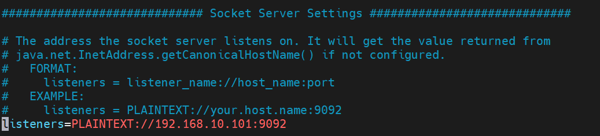

# 一、本地Python Kafka发送数据，服务端Kafka消费不到

### 1. 问题描述

在本地通过python的Kafka模块和Pykafka模块创建Kakfa生产者往服务器的Kakfa发送数据，在服务端使用Kakfa消费者消费不到数据

### 2. 问题原因

Kafka的配置文件`server.properties`中的配置项`listeners`默认被注释掉了，导致kafka只能接收本机`localhost`的数据

### 3. 解决方案

将listeners配置项改为`PLAINTEXT://192.168.10.101:9092`(我的服务器ip为192.168.10.101)，重启kafka可以消费到数据

