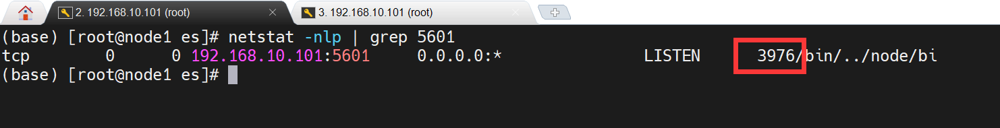

# 一、`后台启动Kibana之后无法找到进程号`

### 1. 后台启动Kibana命令

```bash
nohup bin/kibana &
```

### 2. 找到Kibana进程号的方法

```bash
netstat -nlp | grep 5601
```

`图中圈住的地方就是进程号`



### 3. 杀死Kibana

```bash
kill -9 3976
```

