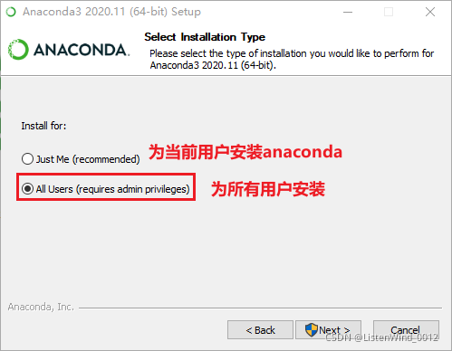
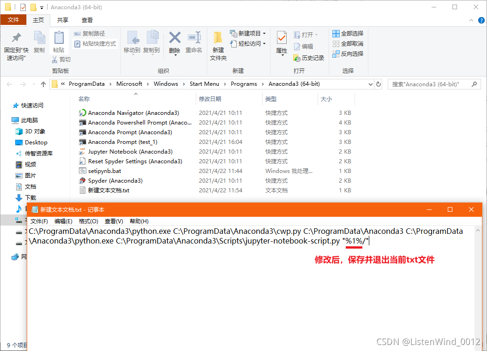

# 一.Anaconda简介

- Anaconda 是最流行的数据分析平台，全球两千多万人在使用
- Anaconda 附带了一大批常用数据科学包
	- conda
	- Python
	- 集成150 多个科学包及其依赖项（默认的base环境）
- Anaconda 是在 conda（一个包管理器和环境管理器）上发展出来的
	- Conda可以帮助你在计算机上安装和管理数据分析相关包
	- Anaconda的仓库中包含了7000多个数据科学相关的开源库
- Anaconda 包含了虚拟环境管理工具
	- 通过虚拟环境可以使不同的Python或者开元库的版本同时存在
- Anaconda 可用于多个平台（ Windows、Mac OS X 和 Linux）
- 我们平时使用Anaconda 自带的jupyter notebook来进行开发，Anaconda 是工具管理器，jupyter notebook是代码编辑器（类似于pycharm，但jupyter notebook是基于html网页运行的）
# 二.Anaconda下载
**因为Anaconda官网的下载速度比较慢，所以可以[点击前往百度网盘下载](https://pan.baidu.com/s/1BpBCjU81rdrS4iH0AUL75w) 提取码：cizi** 

[Anaconda官方网站](https://www.anaconda.com/products/individual)


# 三.Anaconda安装
1. 点击安装


2. 选择操作系统中的用户


3. 选择安装路径


4. 建议都勾选，自动添加环境变量，自动安装python


5. 等待安装


6. 安装完毕


7. 勾选使用个人版


# 四.Anaconda的使用
安装好之后部分版本不会在你的桌面创建快捷方式，但是在开始菜单的最近添加中我们可以看到安装好的anaconda3图标；点击就可以打开anaconda了


# 五.Anaconda的虚拟环境
### 1. 虚拟环境的作用
- 很多开源库版本升级后API有变化，老版本的代码不能在新版本中运行
- 将不同Python版本/相同开源库的不同版本隔离
- 不同版本的代码在不同的虚拟环境中运行
### 2. 通过Anaconda界面创建虚拟环境

### 3. 通过命令行创建虚拟环境
在anaconda管理界面打开cmd命令行终端

- 命令行终端对虚拟环境的操作命令如下

> conda create -n 虚拟环境名字 python=3.8  #创建虚拟环境 python=3.8 指定python版本
> conda activate 虚拟环境名字 #进入虚拟环境
> conda deactivate #退出虚拟环境
> conda remove -n 虚拟环境名字 --all  #删除虚拟环境
> conda env list #查看虚拟环境
# 六.Anaconda的包管理功能
- 在anaconda管理界面打开cmd命令行终端

-可以通过conda install 安装【不推荐】
> conda install 包名字
- 但更推荐使用pip命令来安装python的第三方包【推荐】
> pip install 包名字
- 安装其他包速度慢可以指定国内镜像
> 阿里云：https://mirrors.aliyun.com/pypi/simple
> 豆瓣：https://pypi.douban.com/simple/
> 清华大学：https://pypi.tuna.tsinghua.edu.cn/simple/
> 中国科学技术大学 http://pypi.mirrors.ustc.edu.cn/simple/
> pip install 包名 -i https://mirrors.aliyun.com/pypi/simple/  #通过阿里云镜像安装

# 七、Jupyter主题与字体配置

### 1. 下载一个python库

> pip install --upgrade jupyterthemes

### 2. jupyterthemes的各种参数介绍

- 查看所有可用的主题

	```powershell
	jt -l
	```
	
- 查看jupyterthemes的帮助
	

	```powershell
	jt -h
	```
	
- 设置代码行的行间距

	```powershell
	jt -lineh 80
	```
	
- 安装主题
	```powershell
	jt -t oceans16
	```
	
- 更换代码字体
	```powershell
	jt -f roboto
	```
	
- 更换代码字体大小

	```powershell
	jt -fs 18
	```
	
- 更换笔记本字体

	```powershell
	jt -nf roboto
	```
	
- 更换笔记本字体大小

	```powershell
	jt -nfs 18
	```
	
- 文字/MarkDown单元字体

	```powershell
	jt -tf roboto
	```
	
- 文字/MarkDown单元字体大小

	```powershell
	jt -tfs 18
	```
	
- Pandas DF字体大小

	```powershell
	jt -dfs 18
	```
	
- 输出区域字体大小

	```powershell
	jt -ofs 18
	```
	
- 目录页面边距

	```powershell
	jt -m 200
	```
	
- 更改代码行宽度

	```powershell
	jt -cellw 2000
	```
	
- 显示工具箱

	```powershell
	jt -T
	```
	
- 光标宽度

  ```powershell
  jt -cursw 10
  ```

各种参数可以搭配使用，分享一个我个人比较喜欢的配置

> jt -t monokai -lineh 100 -fs 18 -nfs 18 -cellw 1000 -T
> 
> 

### 三.让我们看一下官方的文档

```powershell
(Just_do_it) C:\Users\14116>jt -h
usage: jt [-h] [-l] [-t THEME] [-f MONOFONT] [-fs MONOSIZE] [-nf NBFONT] [-nfs NBFONTSIZE] [-tf TCFONT]
          [-tfs TCFONTSIZE] [-dfs DFFONTSIZE] [-ofs OUTFONTSIZE] [-mathfs MATHFONTSIZE] [-m MARGINS]
          [-cursw CURSORWIDTH] [-cursc CURSORCOLOR] [-cellw CELLWIDTH] [-lineh LINEHEIGHT] [-altp] [-altmd] [-altout]
          [-P] [-T] [-N] [-kl] [-vim] [-r] [-dfonts]

optional arguments:
  -h, --help            show this help message and exit
  -l, --list            list available themes
  -t THEME, --theme THEME
                        theme name to install
  -f MONOFONT, --monofont MONOFONT
                        monospace code font
  -fs MONOSIZE, --monosize MONOSIZE
                        code font-size
  -nf NBFONT, --nbfont NBFONT
                        notebook font
  -nfs NBFONTSIZE, --nbfontsize NBFONTSIZE
                        notebook fontsize
  -tf TCFONT, --tcfont TCFONT
                        txtcell font
  -tfs TCFONTSIZE, --tcfontsize TCFONTSIZE
                        txtcell fontsize
  -dfs DFFONTSIZE, --dffontsize DFFONTSIZE
                        pandas dataframe fontsize
  -ofs OUTFONTSIZE, --outfontsize OUTFONTSIZE
                        output area fontsize
  -mathfs MATHFONTSIZE, --mathfontsize MATHFONTSIZE
                        mathjax fontsize (in %)
  -m MARGINS, --margins MARGINS
                        fix margins of main intro page
  -cursw CURSORWIDTH, --cursorwidth CURSORWIDTH
                        set cursorwidth (px)
  -cursc CURSORCOLOR, --cursorcolor CURSORCOLOR
                        cursor color (r, b, g, p)
  -cellw CELLWIDTH, --cellwidth CELLWIDTH
                        set cell width (px or %)
  -lineh LINEHEIGHT, --lineheight LINEHEIGHT
                        code/text line-height (%)
  -altp, --altprompt    alt input prompt style
  -altmd, --altmarkdown
                        alt markdown cell style
  -altout, --altoutput  set output bg color to notebook bg
  -P, --hideprompt      hide cell input prompt
  -T, --toolbar         make toolbar visible
  -N, --nbname          nb name/logo visible
  -kl, --kernellogo     kernel logo visible
  -vim, --vimext        toggle styles for vim
  -r, --reset           reset to default theme
  -dfonts, --defaultfonts
                        force fonts to browser default
```

# 八、Jupyter notebook_快速打开ipynb文件

每次打开ipynb文件，都需要启动jupyter notebook，不能直接双击ipynb文件直接打开；有没有好的办法直接打开ipynb文件呢？我们以win10系统为例，解决办法如下：

- 找到jupyter notebook的快捷方式，并打开文件位置


- 右键单击jupyter notebook快捷方式图标，选择属性->快捷方式，复制目标中的内容

- 将复制的文本内容保存在新创建.txt文本文件中

- 将文本中的%USERPROFILE%改为%1%后，保存文件并退出

- 修改文件名，后缀名一定改为.bat，比如setipynb.bat

- 找到任意的.ipynb文件，右键属性->点击更改打开方式->选择更多应用

- 向下拉动，点击最后的在这台电脑上查找其他应用

- 找到并选择刚才重名的、后缀为.bat的文件

 - 选择完.ipynb文件的打开方式之后，最后点击确定，此时再打开.ipynb文件直接双击即可
 

# 九、Jupyter notebook的使用教程

### 1. 启动 Jupyter Notebook

##### 1.1 通过Anaconda启动 Jupyter Notebook


##### 1.2 通过终端启动 Jupyter Notebook

```powershell
# 可选操作，切换虚拟环境，使用不同的python解释器和包
conda activate 虚拟环境名字 

# 切换磁盘位置，可选操作
cd d:/
d:

# 启动jupyter notebook
jupyter notebook
```
### 二.Jupyter Notebook的使用

- 新建notebook文档

 - 新建文件之后会打开Notebook界面
 
 - 菜单栏中相关按钮功能介绍：

> Jupyter Notebook的代码的输入框和输出显示的结果都称之为cell，cell行号前的 * ，表示代码正在运行


# 十、Jupyter notebook快捷键总结

### 一.编辑模式

 1. Tab : 代码补全或缩进
 2. Shift-Tab : 提示
 3. Ctrl-] : 缩进
 4. Ctrl-[ : 解除缩进
 5. Ctrl-A : 全选
 6. Ctrl-Z : 复原
 7. Ctrl-Shift-Z : 再做
 8. Ctrl-Y : 再做
 9. Ctrl-Home : 跳到单元开头
 10. Ctrl-Up : 跳到单元开头
 11. Ctrl-End : 跳到单元末尾
 12. Ctrl-Down : 跳到单元末尾
 13. Ctrl-Left : 跳到左边一个字首
 14. Ctrl-Right : 跳到右边一个字首
 15. Ctrl-Backspace : 删除前面一个字
 16. Ctrl-Delete : 删除后面一个字
 17. Esc : 进入命令模式
 18. Ctrl-M : 进入命令模式
 19. Shift-Enter : 运行本单元，选中下一单元
 20. Ctrl-Enter : 运行本单元
 21. Alt-Enter : 运行本单元，在下面插入一单元
 22. Ctrl-Shift-- : 分割单元
 23. Ctrl-Shift-Subtract : 分割单元
 24. Ctrl-S : 文件存盘
 25. Shift : 忽略
 26. Up : 光标上移或转入上一单元
 27. Down :光标下移或转入下一单元

### 二.命令行模式

1. Enter : 转入编辑模式
2. Shift-Enter : 运行本单元，选中下个单元
3. Ctrl-Enter : 运行本单元
4. Alt-Enter : 运行本单元，在其下插入新单元
5. Y : 单元转入代码状态
6. M :单元转入markdown状态
7. R : 单元转入raw状态
8.  设定 1 级标题
9. 设定 2 级标题
10. 设定 3 级标题
11. 设定 4 级标题
12. 设定 5 级标题
13. 设定 6 级标题
14. Up : 选中上方单元
15. K : 选中上方单元
16. Down : 选中下方单元
17. J : 选中下方单元
18. Shift-K : 扩大选中上方单元
19. Shift-J : 扩大选中下方单元
20. A : 在上方插入新单元
21. B : 在下方插入新单元
22. X : 剪切选中的单元
23. C : 复制选中的单元
24. Shift-V : 粘贴到上方单元
25. V : 粘贴到下方单元
26. Z : 恢复删除的最后一个单元
27. D,D : 删除选中的单元
28. Shift-M : 合并选中的单元
29. Ctrl-S : 文件存盘
30. S : 文件存盘
31. L : 转换行号
32. O : 转换输出
33. Shift-O : 转换输出滚动
34. Esc : 关闭页面
35. Q : 关闭页面
36. H : 显示快捷键帮助
37. I,I : 中断Notebook内核
38. 0,0 : 重启Notebook内核
39. Shift : 忽略
40. Shift-Space : 向上滚动
41. Space : 向下滚动