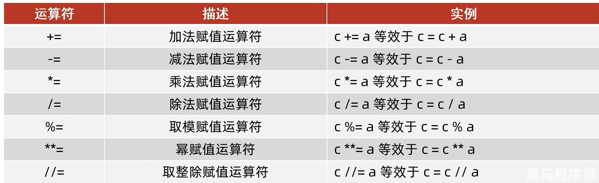

# # 一、字面量

### 1. 什么是字面量

在代码中，被写下来的固定的值，称之为字面量

```python
"abc"
1
1.2
```

### 2. 常用的值类型


### 3. 什么是字符串

字符串(string)，又称文本，是由任意数量的字符如中文、英文、各类符号、数字等组成。所以叫做字符的串

```python
"EuropeanSheik"
"Hadoop"
"Spark SQL"
```

# 二、注释

### 1. 什么是注释

在程序代码中对程序代码进行解释说明的文字

### 2. 单行注释

以`#`开头，`#`右边的所有文字当做说明，而不是真正要执行的程序，起辅助说明作用

```python
# 这是一个单行注释
print("Hello World")
```

### 3. 多行注释

以一对`"""`引起来解释说明一段代码的作用

```python
"""
这是多行注释的第一行
这是多行注释的第二行
"""
print("Hello World")
```

# 三、变量

### 1. 什么是变量

在程序运行时，能储存计算结果或能表示值的抽象概念

### 2. 变量的定义格式

`变量名称 = 变量的值`

```python
# 变量名称 = 变量的值
number = 1
```

# 四、数据类型

### 1. 数据类型分类


### 2. 查看数据类型

`type(被查看数据的类型)`

```python
# type(被查看数据的类型)
print(type(123))        # <class 'int'>
print(type(13.14))      # <class 'float'>
print(type("abc"))      # <class 'str'>
```

```python
print(type(123) == int)         # True
print(type(123) == "int")       # False
print(type(13.14) == float)     # True
print(type(13.14) == "float")   # False
print(type("abc") == str)       # True
print(type("abc") == "str")     # False
```

# 五、数据类型转换

### 1. 什么是数据类型转换

数据类型之间，在特定的场景下，是可以相互转换的，如字符串转数字、数字转字符串等

### 2. 整数转换

```python
# 字符串转换整数
print(int("10"))  # 10
# 浮点型转换整数
print(int(13.14))  # 13
```

### 3. 浮点数转换

```python
# 整数转浮点数
print(float(10))        # 10.0
# 字符串转浮点数
print(float("13.14"))   # 13.14
```

### 4. 字符串转换

```python
# 整数转字符串
print(str(10))
# 浮点数转字符串
print(str(13.14))
```

# 六、标识符

### 1. 什么是标识符

是用户在变成的时候所使用的一系列名字，用于给变量、类、方法等命名

### 2. 标识符命名规则

- 内容限定：只允许使用英文、中文、数字、下划线
  - 不推荐使用中文
  - 数字不可以开头
- 大小写敏感
  - Hadoop和hadoop不相等
- 不可使用关键字

### 3. 关键字

Python中有一系列单词，称之为关键字，关键字在Python中都有特定用途，不可以使用它们作为标识符


### 4. 变量命名规范

- 见名知意
  - 明了：尽量做到，看到名字，就知道什么意思
  - 简介：尽量在确保“明了”的前提下，减少名字的长度
- 下划线命名法
  - 多个单词组合变量名，要使用下划线做分隔
- 英文字母全小写
  - 命名变量中的英文字母，应全部小写

# 七、运算符

### 1. 算数(数学)运算符


```python
# 加
print(1 + 2)    # 3
# 减
print(1 - 2)    # -1
# 乘
print(2 * 3)    # 6
# 除
print(5 / 2)    # 2.5
# 取整除
print(5 // 2)   # 2
# 取余
print(5 % 2)    # 1
# 指数
print(5 ** 2)   # 25
```

### 二、赋值运算符


```python
# 赋值运算符
a = 1
print(a)
a = 2
print(a)
```

### 三、算数赋值运算符



```python
x = 5
y = 2
# +=
x += y
print(x)    # 7
# -=
x += y
print(x)    # 9
```

# 八、字符串

### 0. 什么是字符串

- 只可以存储字符串
- 长度任意
- 支持下标索引
- 允许重复字符串存在
- 不可以修改
- 支持for循环

### 1. 字符串的三种定义方式

- 单引号定义法

  ```python
  name = '飞Link'
  ```

- 双引号定义法

  ```python
  name = "飞Link"
  ```

- 三引号定义法

  - 和多行注释的写法一样，同样支持换行操作
  - 使用变量接收它，它就是字符串
  - 不使用变量接收它，就可以作为多行注释使用

  ```python
  name = """我是
  		飞Link"""
  ```

### 2. 字符串的引号嵌套

- 单引号定义法，可以内含双引号

- 双引号定义法，可以内含单引号

- 可以使用转移字符(\)来将引号接触效用，变成普通字符串

  ```python
  # 单引号中嵌套双引号
  a = 'Spark"Flink'
  # 双引号中嵌套单引号
  b = "Spark'Flink"
  # 使用转义符(\)解除转义
  c = "Spark\"Flink"
  ```

### 3. 字符串的拼接

可以将两个字符串拼接成一个字符串，通过`+`号即可完成

```python
a = "飞"
b = "Link"
c = a + b
print(c)	# 飞Link
```

### 4. 字符串格式化


```python
age = 20
sex = "男生"
print("我是%s,我的年龄是%s岁" % (sex, age))
```

### 5. 数字精度控制

- 语法

  - `m`，控制宽度，要求是数字，设置的宽度小于数字自身，不生效

  - `.n`，控制小数点精度，要求是数字，会进行小数的四舍五入
  - 小数点和小数部分也算入宽度计算

- 示例
  - `%5d`：表示将整数的宽度控制在5为，如数字11，被设置为5d，就会变成：`[空格][空格][空格]11`，用三个空格补足宽度
  - `%5.2f`：表示将宽度控制为5，将小数点精度设置为2
  - `%7.2f`：对11.345设置了%7.2f后，结果是`[空格][空格]11.35`。2个空格补足宽度，小数部分限制2位精度后，四舍五入为.35
  - `%.2f`：表示不限制宽度，只设置小数点精度为2，如11.345设置%.2f后，结果是11.35

### 6. 字符串格式化的第二种方法

通过语法`f"内容{变量}"的格式来快速格式化

```python
name = "飞Link"
print(f"我是{name}")  # 我是飞Link
```

### 7. 字符串格式化

```python
print(f"3*4的结果是{3*4}")  # 3*4的结果是12
```

### 8. 字符串的方法(index)

- 功能：查找特定字符串的下标索引值

```python
字符串.index(字符串)
```

```python
s = 'Python'
print(s.index('o'))
```

### 9. 字符串的方法(replace)

- 功能：将字符串内的全部：字符串1，替换为字符串2

```python
字符串.replace(字符串1, 字符串2)
```

```python
s = 'Python'
print(s.replace('P', 'p'))
```

### 10. 字符串的方法(split)

- 功能：按照指定的分隔字符串，将字符串划分为多个字符串，并存入列表对象中

```python
字符串.split(分隔字符串)
```

```python
s = "Python,Java,Scala"
print(s.split(','))
```

### 11. 字符串的方法(strip)

- 功能：取出字符串前后的指定字符，默认去除空格

```python
字符串.strip()
```

```python
s = ' Python'
# 去除空格
print(s.strip())
# 去除n
print(s.strip('n'))
```

### 12. 字符串的方法(count)

- 功能：统计字符串中某字符串的出现次数

```python
字符串.count(字符串)
```

```python
s = "Python Java Scala"
print(s.count('a'))
```

### 13. 字符串的切片

- 根据步长获取从开始索引到结束索引的元素，步长默认为0

```python
字符串[开始索引:结束索引:步长]
```

```python
s = "Python Java Scala"
print(s[0:5])
```

### 14. 字符串大小的比较

- 在程序中，字符串所用的所有字符都有其对应的ASCII码表值，每一个字符都能对应上一个数字的码值，字符串进行比较就是基于数字的码值大小进行比较的
- 字符串是按位比较，也就是一位位进行对比，只要有一位打，那么整体就大

### 15. 字符串的方法(upper)

- 功能：将字符串内的字母全部大写

```python
字符串.upper()
```

```python
s = 'Python'
print(s.upper())
```

### 16. 字符串的方法(lower)

- 功能：将字符串内的字母全部小写

```python
字符串.lower()
```

```python
s = 'Python'
print(s.lower())
```

### 17. 字符串的方法(capitalize)

- 功能：将字符串的首字母大写

```python
字符串.capitalize()
```

```python
s = 'apple orange age'
print(s.capitalize())
```

### 18. 字符串的方法(title)

- 功能：将字符串内的每个单词首字母大写

```python
字符串.title()
```

```python
s = 'apple orange age'
print(s.title())
```

### 19. 字符串的方法(startswith)

- 功能：判断字符串是否以给定字符串开头

```python
字符串.startwith(字符串)
```

```python
s = 'apple orange age'
print(s.startswith('apple'))
```

### 20. 字符串的方法(endswith)

- 功能：判断字符串是否以给定字符串结尾

```python
字符串.endswith(字符串)
```

```python
s = 'apple orange age'
print(s.endswith('apple'))
```

### 21. 字符串的方法(find)

- 功能：找到给定字符串首次出现的索引

```python
字符串.find(字符串)
```

```python
s = 'apple orange age'
print(s.find('age'))
```

### 22. 字符串的方法(isalpha)

- 功能：判断字符串是否是字母

```python
字符串.isalpha()
```

```python
s = 'appleorangeage'
print(s.isalpha())
```

### 23. 字符串的方法(isdigit)

- 功能：判断字符串是否是数字

```python
字符串.isdigit()
```

```python
s = "12345"
print(s.isdigit())
```

### 24. 字符串的方法(isalnum)

- 功能：判断字符串是否是字母或数字

```python
字符串.isalnum()
```

```python
s = "123python"
print(s.isalnum())
```


# 九、input输入

### 1. 什么是input

input()函数，用来获取键盘输入，在括号内可以添加提示内容

```python
name = input("请输入你的名字:")
print(name)
'''
请输入你的名字:飞Link
飞Link
'''
```

# 十、布尔类型

### 1. 什么是布尔类型

进行判断，只有两个类型(True, False)，不仅可以自行定义，同时也可以通过计算得来

```python
print(3 == 3)   # True
print(3 > 2)    # True
print(3 < 2)    # False
```


# 十一、比较运算符


# 十二、if判断语句

### 1. if语句

当if判断条件结果为True时，代码会被执行，为False时，代码不会执行

```python
if 条件:
    条件为True时要做的事情
```

```python
if 3 > 2:
    print("3 大于 2")     # 3 大于 2
```

### 2. if else判断语句

当if判断条件结果为True时，if内的代码会被执行，为False时，else内的代码会被执行

```python
if 条件:
    条件为True时要做的事情
else:
    条件为False时要做的事情
```

```python
if 2 > 3:
    print("2 大于 3")
else:
    print("3 大于 2") # 3 大于 2
```

### 3. if elif else判断语句

如果if判断条件为True时，if内的代码会被执行，如果if的判断条件为False时，会继续判断elif的条件，如果为True就执行elif内的代码，如果elif的条件为False，就执行else内的代码

```python
if 条件1:
    条件1为True要做的事情
elif 条件2:
    条件1为False并且条件2为True要做的事情
else:
    条件1和条件2都为False要做的事情
```

```python
if 3 > 3:
    print("3 大于 3")
elif 3 < 3:
    print("3 小于 3")
else:
    print("3 等于 3") # 3 等于 3
```

# 十三、while循环语句

while循环的循环条件是自定义的，自行控制循环条件，只要条件满足(为True)，就会无限执行

```python
while 条件:
    条件满足时做的事情
```

```python
i = 0
while i < 5:
    print(i)
    i += 1
```

# 十四、for循环语句

### 1. 什么是for循环

for循环是一种轮询机制，是对一批内容进行逐个处理

```python
for 临时变量 in 待处理数据集:
    循环满足条件时执行的代码
```

```python
for i in (1, 2, 3):
    print(i)
```

### 2. range语句

- range(num)

  - 获取一个从0开始，到num结束的数字序列(不含num本身)

  - 如`range(5)`获取的数据是`[0, 1, 2, 3, 4]`


- range(num1, num2)

  - 获取一个从num1开始，到num2结束的数字序列(不含num2本身)

  - 如`range(5, 10)`获取的数据是`[5, 6, 7, 8, 9]`


- range(num1, num2, step)

  - 获取一个从num1开始，到num2结束的数字序列(不含num2本身)，数字之间的步长，以step为准(step默认为1)

  - 如`range(5, 10, 2)`取得的数据是`[5, 7, 9]`


### 3. for循环遍历range序列

```python
for i in range(5):
    print(i)
```

### 4. for循环的变量作用域

- for内定义的变量称为临时变量，在编程规范上，作用范围(作用域)值限定在for循环内部

- 如果在for循环外部访问临时变量
  - 实际上是可以访问到的
  - 在编程规范上，是不允许、不建议这么做的

```python
for i in range(5):
    print("临时变量i的值为:{}".format(i))
# 在for循环外取临时变量的值会取循环最后一次的值
print("i的值为{}".format(i))			# 4
```

```python
i = 0
for i in range(5):
    print("临时变量i的值为{}".format(i))
# 使用全局变量作为for循环的临时变量，全局变量的值会被覆盖
print(i)	# 4
```

# 十五、continue和break

### 1. continue

- continue关键字用于：中断本次循环，直接进入下一次循环
- continue只能控制它所在的循环

```python
for i in range(5):
    if i == 3:
        continue
    print(i, end=",")   # 0,1,2,4,
```

### 2. break

- break关键字用于：直接结束所在循环
- break只能控制它所在的循环

```python
for i in range(5):
    if i == 3:
        break
    print(i, end=",")   # 0,1,2,
```

# 十六、函数

### 1. 什么是函数

函数是组织好的，可重复使用的，用来实现特定功能的代码段，可以提高代码的复用性，减少重复代码，提高开发效率

### 2. 函数的定义和调用

```python
def 函数名(传入参数):
    函数体
    return 返回值

函数名(传入参数)
```

```python
def add_1(a):
    return a + 1

print(add_1(2))
```

### 3. 函数的传入参数

- 传入参数的功能是：在函数进行计算的时候，接受外部（调用时）提供的数据
- 传入参数的数量是不受限制的
  - 可以不适用参数
  - 也可以仅使用任意N个参数

### 4. 函数的形参和实参

```python
def add(a, b):
    return a + b

print(add(1, 2))
```

- 形参：函数定义中，提供的a和b，称之为：形式参数（形参），表示函数声明将要使用2个参数
  - 参数之间使用逗号进行分隔
- 实参：函数调用中，提供的1和2，称之为：实际参数（实参），表示函数执行时真正使用的参数值
  - 传入的时候，按照顺序传入数据，使用逗号分隔

### 5. 函数的多种传参方式

- 位置参数：调用函数时根据函数定义的参数位置来传递参数

  - 传递的参数和定义的参数的顺序及个数必须一致

  ```python
  def func(name, age):
      print(f"name is {name}")
      print(f"age is {age}")
  
  
  func('飞Link', 20)
  ```

- 关键字参数：函数调用时通过"键=值"形式传递参数

  - 函数调用时，如果有位置参数时，位置参数必须在关键字参数的前面，但关键字参数之间不存在先后顺序

  ```python
  def func(name, age, gender):
      print(f"name is {name}")
      print(f"age is {age}")
      print(f"gender is {gender}")
  
  
  func('飞Link', age=20, gender="男")
  ```

- 缺省参数：缺省参数也叫默认参数，用于定义函数，为参数提供默认值，调用函数时可不传该默认参数的值

  - 所有位置参数必须出现在默认参数前，包括函数定义和调用
  - 函数调用时，如果为缺省参数传值则修改默认参数值，否则使用这个默认值

  ```python
  def func(name, age, gender='男'):
      print(f"name is {name}")
      print(f"age is {age}")
      print(f"gender is {gender}")
  
  
  func('飞Link', age=20)
  ```

- 不定长参数：不定长参数也叫可变参数，用于不确定调用的时候会传递多少个参数(不传参也可以)的场景

  - 位置传递：传进的所有参数都会被args变量收集它会根据传进参数的位置合并为一个元组(tuple)，args是元组类型，这就是位置传递

    ```python
    def func(*args):
        for i in range(len(args)):
            print(f"第{i}个参数是{args[i]}")
    
    
    func("飞Link", 22, "男")
    ```

  - 关键字传递：参数是"键=值"形式的情况下，所有的"键=值"都会被kwargs接受，同时会根据"键=值"组成字典

    ```python
    def func(**kwargs):
        for key in kwargs.keys():
            print(f"{key}:{kwargs[key]}")
    
    func(age=20, name="飞Link", gender="男")
    ```

    


### 5. 函数的返回值

- 函数的返回值，就是程序中函数完成事情后，最后给调用者的结果
- 函数体在遇到return后就结束了，所以写在return后的代码不会执行

```python
def return_3():
    # 返回值是3
    return 3


a = return_3()
print(a)
```

- 函数的多个返回值
  - 按照返回值的顺序，写对应顺序的多个变量接收即可
  - 变量之间用逗号隔开
  - 支持不同类型的数据return

```python
def return_2():
    return 1, 2
x, y = return_2()
print(x, y)
```


### 6. 函数的说明文档

- 作用：对函数进行说明解释，用于辅助理解函数的作用

```python
def func(x, y):
    """
    函数说明
    :param x: 形参x的说明
    :param y: 形参y的说明
    :return: 返回值的说明
    """
    函数体
    return 返回值
```

### 7. 函数的作用域

- 变量作用域指的是变量的作用范围（变量在哪里可用，在哪里不可用），主要分为两类：局部变量和全局变量

- 局部变量：定义在函数体内部的变量，即只在函数体内部生效

- 全局变量：在函数体内、外都能生效的变量

- 使用`global`关键字可以在函数内部声明变量为全局变量

  

# 十七、None类型

### 1. 什么是None类型

- None是Python中的字面量，其类型是`<class 'NoneType'>`
- 无返回值的函数，实际上就是返回了：None这个字面量
- None表示：空的、无实际意义的意思
- 函数返回的None，就表示，这个函数没有返回什么有意义的内容

```python
def return_none():
    print("返回值为None")
print(return_none())
```

### 2. None的应用场景

- 用在函数无返回值上
- 用在if判断上
  - 在if判断中，None等同于False
  - 一般用于在函数中主动返回None，配合if判断做相关处理
- 用在声明无内容的变量上
  - 定义变量，但暂时不需要变量有具体指，可以用None来代替

# 十八、列表

### 1. 什么是列表

- 可以容纳多个元素
- 可以容纳不同类型的元素
- 数据是有序存储的
- 允许有重复数据
- 可以修改

### 2. 列表的定义

```python
# 字面量
[元素1, 元素2, 元素3, 元素4, ...]
# 定义变量
变量名称 = [元素1, 元素2, 元素3, 元素4, ...]
# 定义空列表
变量名称 = []
变量名称 = list()
# 定义嵌套列表
变量名称 = [[元素1, 元素2, 元素3], [元素4, 元素5]]
```

```python
# 普通列表
list1 = [1, 2, 3]
# 空列表
list2 = []
# 空列表
list3 = list()
# 列表存储不同数据类型
list4 = [1, 2, "飞Link", "EuropeanSheik"]
# 列表嵌套
list5 = [[1, 2, 3], ["a", "b"]]
```

### 3. 列表的索引

- 列表中的每一个元素，都有其位置下标索引，从前向后的方向，从0开始，依次递增，只需要按照下标索引，即可取得对应位置的元素
- 列表也可以使用反向索引，从后向前：从-1开始，依次递减(-1, -2, -3)

```python
列表[索引]
```

```python
# 普通的列表索引
name_list = ['Tom', 'Lily', 'Rose']
print(name_list[0])
print(name_list[-1])
# 嵌套的列表索引
name_list = [['Tome', 'Lily'], 'Rose']
print(name_list[0][1])
```

### 4.修改列表的元素

-  对指定下标的值进行重新赋值

```python
列表[下标] = 值
```

```python
ll = ['Python', 'Java', 'C']
ll[0] = 'Scala'
print(ll)
```

### 5. 列表的方法(index)

- 功能：查找指定元素在列表的下标，如果找不到，报错ValueError

```python
列表.index(元素)
```

```python
ll = ['Python', 'Java', 'C']
print(ll.index('Java'))     # 1
print(ll.index('Spark'))    # 报错
```

### 6. 列表的方法(insert)

- 功能：在指定的下标位置，插入指定的元素

```python
列表.insert(下标,元素)
```

```python
ll = ['Python', 'Java', 'C']
ll.insert(1, 'Scala')
print(ll)
```

### 7. 列表的方法(append)

- 功能：将指定元素，追加到列表的尾部

```python
列表.append(元素)
```

```python
ll = ['Python', 'Java', 'C']
ll.append('Scala')
print(ll)
```

### 8. 列表的方法(extend)

- 功能：将其它数据容器的内容取出，依次追加到列表尾部

```python
列表.extend(其他数据容器)
```

```python
l1 = ['a', 'b', 'c']
l2 = ['x', 'y', 'z']
l1.extend(l2)
print(l1)
```

### 9. 列表的方法(pop)

- 功能：删除指定索引的元素，同时将删除的元素返回

```python
列表.pop(索引)
```

```python
l1 = ['a', 'b','c']
print(l1.pop(1))
```


### 10. 列表的方法(remove)

- 功能：删除列表中第一个匹配的元素

```python
列表.remove(元素)
```

```python
l1 = ['a', 'b','c', 'a']
l1.remove('a')
print(l1)
```

### 11. 列表的方法(clear)

- 功能：清空列表内容

```python
列表.clear()
```

```python
l1 = ['a', 'b', 'c']
l1.clear()
print(l1)
```

### 12. 列表的方法(count)

- 功能：统计元素在列表内的数量

```python
列表.count(元素)
```

```python
l1 = ['a', 'b', 'c']
print(l1.count('a'))
```

### 13. 列表的切片

- 根据步长获取从开始索引到结束索引的元素，步长默认为1

```python
列表[开始索引:结束索引:步长]
```

```python
s = ['Python', 'Java', 'Scala']
print(s[1:3])
print(s[::-1])
```


# 十九、元组

### 1. 什么是元组

- 可以容纳多个数据
- 可以容纳不同类型的数据
- 数据是有序存储的
- 允许重复数据存在
- 不可以修改
- 支持for循环

### 2. 元组定义

```python
# 元组字面量
(元素1, 元素2, 元素3)
# 定义元组变量
变量名称 = (元素1, 元素2, 元素3)
# 定义空元祖
变量名称 = ()
变量名称 = tuple()
# 定义嵌套元组
变量名称 = ((元素1, 元素2), 元素3)
```

```python
# 元组字面量
(1, 2, 3)
# 定义元组变量
a = (1, 2, 3)
# 定义空元祖
b = ()
c = tuple()
# 定义嵌套元组
d = ((1, 2), 3)
```

### 3. 元组的方法(index)

- 功能：查找某个数据，如果数据存在返回对应的下标，否则报错

```python
元组.index()
```

```python
t = ('a', 'b', 'c')
print(t.index('a'))
```

### 4. 元组的方法(count)

- 功能：统计某个数据在元组出现的次数

```python
元组.count()
```

```python
t = ('a', 'b', 'c')
print(t.count('a'))
```

### 5. 元组的切片

- 根据步长获取从开始索引到结束索引的元素，步长默认为0

```python
元组[开始索引,结束索引,步长]
```

```python
t = ("Python", "Scala", "Java", "html", "MySQL")
print(t[1:5:2])
```

# 二十、集合

### 1. 什么是集合

- 可以容纳多个数据
- 可以容纳不同类型的数据
- 数据是无序存储的
- 不允许重复数据存在
- 可以修改
- 支持for循环

### 2. 集合的定义

```python
# 定义集合字面量
{元素1, 元素2, 元素3}
# 定义集合变量
变量名称 = {元素1, 元素2, 元素3}
# 定义空集合
变量名称 = set()
```

```python
# 定义集合字面量
{1, 2, 3}
# 定义集合变量
s1 = {1, 2, 3}
# 定义空集合
s2 = set()
```

### 3. 集合的方法(add)

- 功能：将指定元素，添加到集合中

```python
集合.add(元素)
```

```python
s = {1, 2, 3}
s.add(4)
print(s)
```

### 4. 集合的方法(remove)

- 功能：将指定元素，从集合中移除

```python
集合.remove(元素)
```

```python
s = {1, 2, 3}
s.remove(2)
print(s)
```

### 5. 集合的方法(pop)

- 功能：从集合中随机取出一个元素

```python
集合.pop()
```

```python
s = {1, 2, 3}
a = s.pop()
print(s)
print(a)
```

### 6. 集合的方法(clear)

- 功能：清空集合

```python
集合.clear()
```

```python
s = {1, 2, 3}
s.clear()
print(s)
```

### 7. 集合的方法(difference)

- 功能：取出集合1和集合2的差集

```python
集合1.difference(集合2)
```

```python
s1 = {1, 2, 3}
s2 = {3, 4, 5}
print(s1.difference(s2))
```

### 8. 集合的方法(difference_update)

- 功能：在集合1中，删除和集合2相同的元素

```python
集合1.difference_update(集合2)
```

```python
s1 = {1, 2, 3}
s2 = {3, 4, 5}
s1.difference_update(s2)
print(s1)
```

### 9. 集合的方法(union)

- 功能：将集合1和集合2组成新的集合

```python
集合1.union(集合2)
```

```python
s1 = {1, 2, 3}
s2 = {3, 4, 5}
print(s1.union(s2))
```

# 二十一、字典

### 1. 什么是字典

- 可以容纳多个数据
- 可以容纳不同类型的数据
- 每一分数据是KeyValue键值对
- 可以通过Key获取到Value，Key不可重复(重复会覆盖)
- 不支持下标索引
- 可以修改(增加或删除更新元素等)
- 支持for循环，不支持while循环

### 2. 字典的定义

```python
# 定义字典字面量
{key1: value1, key2: value2, key3: value3}
# 定义字典变量
d1 = {key1: value1, key2: value2, key3: value3}
# 定义空字典
d2 = {}
d3 = dict()
```

```python
d = {'a': 1, 'b': 2, 'c': 3}
```

### 3. 字典数据的获取

```python
d = {'a': 1, 'b': 2, 'c': 3}
print(d['a'])
```

### 4. 字典的添加和修改

```python
d = {'a': 1, 'b': 2, 'c': 3}
# 添加数据
d['d'] = 4
# 修改数据
d['a'] = 5
print(d)
```

### 5. 字典的方法(pop)

- 功能：获取指定key的value，同时指定的key的数据被删除

```python
字典.pop(key)
```

```python
d = {'a': 1, 'b': 2, 'c': 3}
d.pop('a')
print(d)
```

### 6. 字典的方法(clear)

- 功能：将字典内的元素清空

```python
字典.clear()
```

```python
d = {'a': 1, 'b': 2, 'c': 3}
d.clear()
print(d)
```

### 7. 字典的方法(keys)

- 功能：得到字典中国全部的key

```python
字典.keys()
```

```python
d = {'a': 1, 'b': 2, 'c': 3}
print(d.keys())
```

- 

# 二十三、内置函数

### 1. del()

- 功能：删除指定下标的元素

```python
del 列表[下标]
```

```python
l1 = ['a', 'b', 'c']
del l1[1]
print(l1)
```

### 2. len()

- 功能：得到一个int数字，表示列表内的元素数量

```python
len(数据容器)
```

```python
l1 = ['a', 'b', 'c']
s1 = 'abcde'
print(len(l1))
print(len(s1))
```

### 3. list()

- 功能：将给定容器转换为列表

```python
list(容器)
```

```python
t = (1, 2, 3, 4)
print(list(t))
```

### 4. str()

- 功能：将给定容器转换为字符串

```python
str(容器)
```

```python
i = 123
l = [1, 2, 3]
print(str(i))
print(str(l))
```

### 5. tuple()

- 功能：将给定容器转化为元组

```python
tuple(容器)
```

```python
l = [1, 2, 3, 4]
print(tuple(l))
```

### 6. set()

- 功能：将给定容器转换为集合

```python
l = [1, 2, 3, 4]
print(set(l))
```

### 7. sorted()

- 功能：将给定容器排序之后以列表的形式返回

- reverse
  - True(倒序)
  - False(正序)(默认)

```python
sorted(容器, [reverse=True])
```

```python
l = [1, 3, 4, 2]
# 正序
print(sorted(l))
# 倒序
print(sorted(l, reverse=True))
```

### 8. print()

- sep：间隔多个输出对象，默认值是一个空格
- end：设定结尾，默认值是换行符(`\n`)
- file：要写入的文件对象，默认是标准输出控制台(sys.stdout)

```python
# 以*分隔输出对象
print("a", "b", "c", sep="*")
# 取消结尾的换行符
print("abc", end='')
# 将输出内容写入到文件中
with open("test.txt", "w", encoding="utf-8") as f:
    print("测试信息", file=f)
```

### 9. input()

- 功能：程序执行过程中接收键盘输入

```python
s = input("请输入内容:")
print(f"输入的内容是:{s}")
```

### 10. range()

- 功能：返回一个整数序列

```python
# 默认从0开始，步长为1
range(5)
# 在[5, 10)区间内生成序列，步长为1
rage(5, 10)
# 在[5, 10)区间内生成序列，步长为2
range(5, 10, 2)
```

### 11. format()

- 功能：格式化输出字符串

| 符号      | 说明                               |
| --------- | ---------------------------------- |
| `{:.2f}`  | 四舍五入，保留小数点后两位         |
| `{:+.2f}` | 四舍五入，保留小数点后两位，带符号 |
| `{:0>2d}` | 整数左侧补0，总长度为2             |
| `{X<4d}`  | 整数右侧补X，总长度为4             |
| `{:,}`    | 为整数增加逗号分隔符               |
| `{:.2%}`  | 百分比格式化，保留小数点后两位     |
| `{:.2e}`  | 科学计数法，保留小数点后两位       |
| `{:>10d}` | 长度10以内右对齐                   |
| `{:<10d}` | 长度10以内左对齐                   |
| `{:^10d}` | 长度10以内居中对齐                 |
| `{:b}`    | 转为二进制                         |
| `{:#b}`   | 转为带前缀0b的二进制               |
| `{:o}`    | 转为八进制                         |
| `{:#o}`   | 转为带前缀0o的八进制               |
| `{:x}`    | 转为十六进制                       |
| `{:#x}`   | 转为带前缀0x的十六进制             |
| `{:#X}`   | 转为带前缀0X的十六进制             |

```python
print("{:>10}".format("大数据厨艺工程师"))
```

### 12. type()

- 功能：查看对象类型

```python
print(type("123"))
print(type(123))
print(type(12.3))
```

### 13. isinstance()

- 功能：判断对象类型

```python
print(isinstance("123", str))
print(isinstance([1, 2, 3], list))
print(isinstance("123", (list, str)))
```

### 14. enumerate()

- 功能：返回可迭代对象的索引和元素

```python
l = ['a', 'b', 'c']
for i, j in enumerate(l):
    print(i, j)
```

### 15. zip()

- 功能：将两个等长列表的对应元素组成元组后返回一个迭代器

```python
l1 = [1, 2, 3]
l2 = ['x', 'y', 'z']
for i, j in zip(l1, l2):
    print(i, j)
```

### 16. map()

- 功能：对列表中的每一个元素做一次计算，这个计算由函数参数决定，这个作为参数的函数可以是普通的函数，也可以是lambda匿名函数

```python
result = map(lambda x: pow(x, 3), [1, 2, 3])
print(list(result))
```

### 17. chr()

- 功能：返回ASCII编码值对应的字符

```python
print(chr(65))
```

### 18. ord()

- 功能：返回字符对应的ASCII编码值

```python
print(ord('A'))
```

### 19. sum()

- 功能：求列表或元组内数字元素的和

```python
print(sum([1, 2, 3]))
```

### 20. max()

- 功能：求列表或元组内数字元素的最大值

```python
print(max(1, 2, 3, 4))
```

### 21. min()

- 功能：求列表或元组内数字元素的最小值

```python
print(min(1, 2, 3, 4))
```

### 22. abs()

- 功能：求给定数字的绝对值

```python
print(abs(-3.14))
```

### 23. pow()

- 功能：求给定数字元素的n次方

```python
# 求2的3次方
print(pow(2, 3))
```

### 24. divmod()

- 功能：求给定两个元素的商和余数

```python
print(divmod(5, 2))
```

### 25. round()

- 功能：对给定元素小数点进行精确

```python
print(round(3.15156, 2))
```


# 二十四、文件操作

### 1. 文件的操作步骤

1. 打开文件
2. 读写文件
3. 关闭文件

### 2. open()

- 使用open函数，可以打开一个已经存在的文件，或者创建一个新文件
- name：要打开的目标文件名的字符串(可以包含文件所在的具体路径)
- mode：打开文件的模式(访问模式)：只读、写入、追加等
- encoding：编码格式(推荐使用UTF-8)

```python
open(name, mode, encoding)
```

```python
open("a.txt", "r", encoding="utf-8")
```

### 3. mode基础访问模式

- r：以只读方式打开文件。文件的指针将会放在文件的开头，是默认模式
- w：打开一个文件只用于写入。如果该文件已存在则打开文件，并从头开始编辑，原有内容会被删除。如果该文件不存在，创建新文件
- a：打开一个文件用于追加。如果该文件已存在，新的内容将会被写入到已有内容之后。如果该文件不存在，创建新文件进行写入

### 4. 文件对象方法(read)

- 功能：num表示要从文件中读取的数据的长度(单位是字节)，如果没有传入num，那么就表示读取文件中所有的数据

```python
文件对象.read(num)
```

```python
f = open("a.txt", "r", encoding="utf-8")
print(f.read())
```

### 5. 文件对象方法(readlines)

- 功能：readlines可以按照行的方式把整个文件中的内容进行一次性读取，并且返回的是一个列表，其中每一行的数据为一个元素

```python
文件对象.readlines()
```

```python
f = open("a.txt", "r", encoding="utf-8")
print(f.readlines())
```

### 6. 文件对象方法(readline)

- 功能：一次读取一行内容

```python
文件对象.readline()
```

```python
f = open("a.txt", "r", encoding="utf-8")
print(f.readline())
```

### 7. 文件对象方法(close)

- 功能：关闭文件对象

```python
文件对象.close()
```

```python
f = open("a.txt", "r", encoding="utf-8")
f.close()
```

### 8. 文件对象方法(write)

- 功能：将内容写入到文件对象中

```python
文件对象.write()
```

```python
f = open("b.txt", "w", encoding="utf-8")
f.write("456")
f.close()
```

### 9. 文件对象方法(flush)

- 功能：直接调用write，内容并未真正写入文件，而是会积攒在程序的内存中，称之为缓冲区，当调用flush的时候，内容会真正写入文件。这样做是避免频繁的操作硬盘，导致效率下降
- close()方法带有flush()的功能

```python
文件对象.flush()
```

```python
f = open("b.txt", "w", encoding="utf-8")
f.write("456")
f.flush()
f.close()
```

### 10. with open方法

- 通过在with open的语句块中对文件进行操作
- 可以在操作完成后自动关闭close文件，避免遗忘close方法

```python
with open("a.txt", "r") as f:
    print(f.read())
```

# 二十五、异常

### 1. 什么是异常

当检测到一个错误时，Python解释器就无法继续执行了，反而出现了一些错误的提示，这就是所谓的异常

### 2. 捕获异常的作用

天桥南假设某处会出现异常，做好提前准备，当真的出现异常的时候，可以有后续手段

### 3. 语法格式

- 捕获通用异常：适用于所有类型的异常

```python
try:
    可能发生错误的代码
except:
    如果出现异常执行的代码
```

```python
try:
    x = 10 / 0
except:
    print("hello")
```

```python
try:
	x = 10 / 0
except Exception as e:
    print(e)
```

- 捕获指定异常：只用于指定类型的异常

```python
try:
    可能发生错误的代码
except 异常类型 as 异常别名:
    如果出现异常执行的代码
```

```python
try:
    print(a)
except NameError as e:
    print(e)
```

- 捕获多个异常：用元组的方式进行书写

```python
try:
    可能发生错误的代码
except (异常类型1,异常类型2):
    如果出现异常执行的代码
```

```python
try:
    print(1/0)
except (NameError, ZeroDivisionError):
    print('ZeroDivision错误...')
```

- 异常else：else表示如果没有异常要执行的代码

```python
try:
    print(10/5)
except NameError as e:
    print(e)
else:
    print("没有异常")
```

- 异常finally：finally表示无论是否异常都要执行的代码

```python
try:
    print(a)
except NameError as e:
    print(e)
else:
    print("没有异常")
finally:
    print("一定执行的代码")
```

### 4. 异常的传递

```python
def f1():
    pass
def f2():
    f1()
def main():
    f2()
```

- 当函数f1中发生异常，并且没有捕获处理这个异常的时候，异常会传递到f2，当f2也没有捕获处理这个异常的时候，main会捕获这个异常，这就是异常的传递性
- 当所有的函数都没有捕获异常的时候，程序就会报错
- 利用异常具有传递性的特点，当我们想要保证程序不会因为异常崩溃的时候，就可以在main函数中设置异常捕获，由于无论在整个程序哪里发生异常，最终都会传递到main函数中，这样就可以确保所有的异常都会被捕获

# 二十六、Python的模块

### 1. 什么是模块

Python模块是一个Python文件，以.py结尾，模块能定义函数、类和变量，模块里也能包含可执行的代码

### 2. 模块的导入方式

- 模块在使用前需要先导入，导入的语法如下

  > [from 模块名] import [模块 | 类 | 变量 | 函数 | *] [as 别名]

- 常用的组合形式

  ```python
  import 模块名
  from 模块名 import 类、变量、方法等
  from 模块名 import *
  import 模块名 as 别名
  from 模块名 import 功能名 as 别名
  ```

### 3. 自定义模块

- 每个Python文件都可以作为一个模块，模块的名字就是文件的名字，也就是说自定义模块名必须要符合标识符命名规则

- main函数：只在当前文件中调用该函数，其他导入的文件内不符合该条件，不执行main函数的内容

  ```python
  if __name__ == '__main__':
      执行的代码
  ```

- `__all__`：如果一个模块文件中有`__all__`变量，当使用`from xxx import *`导入时，只能导入这个列表中的元素

# 二十七、Python包

### 1. 什么是Python包

从物理上来看，包就是一个文件夹，在该文件夹下包含了一个`__init__.py`文件，该文件夹可用于包含多个模块文件，从逻辑上看，包的本质依然是模块

### 2. 导入包的方式

- 方式一

```python
import 包名.模块名
包名.模块名.目标
```

- 方式二：必须在`__init__.py`文件中添加`__all__ = []`，控制允许导入的模块列表

```python
from 包名 import *
```

### 3. 安装第三方包

```python
# 方式一
pip install 包名称
# 方式二
pip install -i https://pypi.tuna.tsinghua.edu.cn/simple 包名称
```

# 二十八、Python的高级语法

### 1. 三元表达式

```python
条件为真要做的事 if 条件 else 如果条件为假要做的事
```

```python
x = 1
print("x是正数" if x > 0 else "x不是正数")
```

### 2. 列表推导式

```python
l = [pow(i,2) for i in range(5)]
```

### 3. 断言

- 断言就是声明表达式的布尔值必须为真的判定，否则将触发AssertionError异常

```python
# 判断给定元素是否为数字
assert(isinstance(123, (float, int)))
```

### 4. lambda匿名函数

- def关键字，可以定义带有名称的函数，可以基于名称重复使用
- lambda关键字，可以定义匿名函数(无名称)，只能临时使用一次

```python
lambda 传入参数: 函数体
```

```python
lambda x: print(x)
```

- lambda是关键字，表示定义匿名函数
- 传入参数表示匿名函数的形式参数，如：x，y表示接收2个形式参数
- 函数体，就是函数的执行逻辑，只能写一行代码，无法写多行

### 5. 迭代器

- 迭代器是一种可遍历元素的对象，这样遍历只能从第一个元素开始，逐一向后直至结束，不能后退，也不能跳过未遍历的元素
- Python的内置函数iter()可以将列表、字典等可迭代对象转为迭代器
- 内置函数next()可以取得迭代器的下一个元素，每调用一次，就会返回下一个元素；若迭代器已空，则返回一个StopIteration类型的异常

```python
l = [1, 2, 3, 4]
it = iter(l)
print(next(it))
print(next(it))
```

### 6. 生成器

- 生成器是一种特殊的迭代器，通过生成器函数产生。生成器函数看上去类似普通函数，但是用yield替代了return。和return返回结果后结束函数不同，yield返回一个结果，但不会结束函数，而是将函数挂起，等待下一次的迭代

```python
def get_square(n):
    for i in range(n):
        yield pow(i, 2)


grator = get_square(5)
for i in grator:
    print(i)
```

### 7. 装饰器

- 装饰器本质上是一个函数，用来对另一个函数(被装饰的函数对象)在不改动代码的前提下做功能上的补充，如增加身份或权限验证、插入日志等。
- 装饰器以被装饰的函数对象为输入参数，返回一个新的对象。

```python
import time


def timer(func):
    def new_func(*args, **kwargs):
        start_time = time.time()
        func(*args, **kwargs)
        end_time = time.time()
        print("耗时{:.4f}秒".format(end_time-start_time))
    return new_func


@timer
def do_something(delay):
    print("函数开始执行")
    time.sleep(3)
    print("函数结束执行")


do_something(3)
```

### 8. 闭包

- 在Python语言中，闭包指的是携带一个或多个自由量的函数。闭包函数的自由量不是函数的参数，而是生成这个函数时的环境变量。闭包一旦生成，自由量会绑定在函数上，即使离开创造它的环境，自由量依旧有效

```python
def set_sex(sex):       # 定义一个函数生成器
    def sex_and_name(name):     # 生成闭包
        return f"{name}的性别是{sex}"   # 闭包中携带了环境参数sex
    return sex_and_name     # 返回闭包


f = set_sex("男")        # 用闭包生成器生成闭包函数
print(f("飞Link"))       # 该闭包携带的自由量是"男"
```

# 二十九、time模块

### 1. 介绍

- time模块内部定义了一个`time.struct_time`类，用于表示一个时间对象，它包含了年、月、日、时、分、秒、周内日、月内日、年内日等多个属性

### 2. `time.struct_time`类的常用属性

| 属性名     | 说明                              |
| ---------- | --------------------------------- |
| `tm_year`  | 年，例如2022                      |
| `tm_mon`   | 月，取值1~12                      |
| `tm_mday`  | 月内日，取值1~31                  |
| `tm_hour`  | 小时，取值0~23                    |
| `tm_min`   | 分钟，取值0~59                    |
| `tm_sec`   | 秒，取值0~61                      |
| `tm_wday`  | 周内日，星期一至星期日分别对应0~6 |
| `tm_yday`  | 年内日，取值1~366                 |
| `tm_isdst` | 夏令时，取值0、1或-1              |

### 3. time模块常用的函数

| 函数                             | 说明                                                    |
| -------------------------------- | ------------------------------------------------------- |
| `time.time()`                    | 返回从`1970-01-01 00:00:00`至当前时刻的秒数，精度为毫秒 |
| `time.asctime([t])`              | 将struct_time对象转换为日期时间字符串                   |
| `time.ctime([secs])`             | 将时间戳转换为日期时间字符串(返回值受时区影响)          |
| `time.gmtime([secs])`            | 将时间戳转换为零时区struct_time对象                     |
| `time.localtime([secs])`         | 将时间戳转换为本地时区struct_time对象                   |
| `time.mktime(t)`                 | 将struct_time对象或元组代表的时间转换为时间戳           |
| `time.perf_counter()`            | 返回性能计数器的值(以秒为单位)                          |
| `time.process_time()`            | 返回当前进程使用CPU的时间(以秒为单位)                   |
| `time.sleep(secs)`               | 暂停程序(进程或者线程)secs秒                            |
| `time.strftime(format[,t])`      | 将struct_time对象或元组格式化为日期时间字符串           |
| `time.strptime(string[,format])` | 将字符串格式的日期时间转换为struct_time对象             |

```python
import time

# 获取本地时区的时间，返回struct_time类
# time.struct_time(tm_year=2022, tm_mon=8, tm_mday=28, tm_hour=10, tm_min=32, tm_sec=21, tm_wday=6, tm_yday=240, tm_isdst=0)
print(time.localtime())
# 获取格林尼治时间，返回struct_time类
# time.struct_time(tm_year=2022, tm_mon=8, tm_mday=28, tm_hour=2, tm_min=33, tm_sec=12, tm_wday=6, tm_yday=240, tm_isdst=0)
print(time.gmtime())
# 0时间戳，对应东八区是1970年1月1日8时
# time.struct_time(tm_year=1970, tm_mon=1, tm_mday=1, tm_hour=8, tm_min=0, tm_sec=0, tm_wday=3, tm_yday=1, tm_isdst=0)
print(time.localtime(0))
# 0时间戳，对应格林尼治零时区是1970年1月1日0时
# time.struct_time(tm_year=1970, tm_mon=1, tm_mday=1, tm_hour=0, tm_min=0, tm_sec=0, tm_wday=3, tm_yday=1, tm_isdst=0)
print(time.gmtime(0))
# 时间戳转struct_time类
# time.struct_time(tm_year=2022, tm_mon=8, tm_mday=28, tm_hour=10, tm_min=33, tm_sec=20, tm_wday=6, tm_yday=240, tm_isdst=0)
print(time.localtime(1661654000))
# struct_time类转时间戳
# 1661654165.0
print(time.mktime(time.localtime()))
```


```python
import time

# 将当前日期时间格式化
# 2022-08-28 10:41:03
print(time.strftime('%Y-%m-%d %H:%M:%S'))
# 将指定日期时间格式化
# 2022-08-28 10:33:20
print(time.strftime('%Y-%m-%d %H:%M:%S', time.localtime(1661654000)))
# 将格式化日期解析为时间戳
# 1572307200.0
print(time.mktime(time.strptime('2019-10-29 08:00:00', '%Y-%m-%d %X')))     # %X等价于%H:%M:%S
# 1572307200.0
print(time.mktime(time.strptime('2019-10-29 08:00:00', '%Y-%m-%d %H:%M:%S')))s
```


# 三十、datetime模块

### 1. 介绍

datetime模块提供了datetime和timedelta两个内置类，前者表示日期时间，后者表示一个时间段的长度。两个datetime对象相减，即可得到一个timedelta对象。两个timedelta对象，或datetime对象和timedelta对象，可以做加减运算

### 2. datetime类

Datetime类是一个包含来自date对象和time对象所有信息的单一对象。datetime类提供的以下方法可以直接调用，无需实例化

| 方法                               | 功能                                                         |
| ---------------------------------- | ------------------------------------------------------------ |
| `now()`                            | 返回当前的本地datetime对象                                   |
| `utcnow()`                         | 返回当前UTC(协调世界时)日期是时间                            |
| `fromtimestamp(timestamp,tz=None)` | 将时间戳转为datetime类型的时间，tz为时区参数                 |
| `fromisoformat(date_string)`       | 将日期时间字符串转为datetime类型的时间                       |
| `strptime(date_string,format)`     | 将日期时间字符串按照format指定的格式解析生成datetime类型的时间 |

以下方法只有datetime类实例化以后才可以使用

| 方法               | 功能                                                       |
| ------------------ | ---------------------------------------------------------- |
| `date()`           | 返回具有同样year、month和day值的date对象                   |
| `time()`           | 返回具有同样`hour、minute、second、microsecond值的time对象 |
| `timetuple()`      | 返回一个time.struct_time类型的日期时间对象                 |
| `toordinal()`      | 返回日期的格里高利历序号                                   |
| `timestamp()`      | 返回时间戳                                                 |
| `weekday()`        | 返回一个代表星期几的整数，星期一为0，星期日为6             |
| `isoweekday()`     | 返回一个代表星期几的整数，星期一为1，星期日为7             |
| `ctime()`          | 返回一个代表日期和时间的字符串                             |
| `strftime(format)` | 返回一个由显式格式字符串所指明的代表日期和时间的字符串     |

```python
from datetime import datetime

# 获取当前本地时间
# 2022-08-28 11:14:13.365401
print(datetime.now())
# 实例化datetime对象
# 2020-04-03 11:12:13
print(datetime(2020, 4, 3, 11, 12, 13))
# 字符串转datetime对象
# 2020-05-05 10:20:30
print(datetime.fromisoformat('2020-05-05 10:20:30'))
# 字符串转datetime对象
# 2020-10-10 11:12:13
print(datetime.strptime('2020-10-10 11:12:13', '%Y-%m-%d %H:%M:%S'))
# 时间戳转datetime对象
# 2022-08-28 11:06:40
print(datetime.fromtimestamp(1661656000))
# 获取当前UTC时间
# 2022-08-28 03:14:13.368392
print(datetime.utcnow())
# 返回time.struct_time对象
# time.struct_time(tm_year=2022, tm_mon=8, tm_mday=28, tm_hour=11, tm_min=14, tm_sec=13, tm_wday=6, tm_yday=240, tm_isdst=-1)
print(datetime.now().timetuple())
# 返回datetime对象的时间戳
# 1661656453.368392
print(datetime.now().timestamp())
# 返回一个代表星期几的整数,星期一为1，星期日为7
# 7
print(datetime.now().isoweekday())
# 返回一个代表星期几的整数,星期一为0，星期日为6
# 6
print(datetime.now().weekday())
# 返回日期时间字符串
# 2022=08=28 11-14-13
print(datetime.now().strftime('%Y=%m=%d %H-%M-%S'))
```


### 3. timedelta类

timedelta类用来描述一段时间，如两个日期或时间点之间的时间间隔。timedelta对象之间，以及timedelta对象和datetime对象之间可以做加减运算。创建datetime.timedelta对象可以使用下列参数中的一个或多个指定时间段长度。若使用了多个参数，时间段长度为多个参数之和

| 参数         | 含义       |
| ------------ | ---------- |
| weeks        | 周数       |
| days         | 天数(默认) |
| hours        | 小时数     |
| minutes      | 分钟数     |
| seconds      | 秒数       |
| microseconds | 微秒数     |

```python
from datetime import datetime, timedelta


# 生成3天的timedelta对象
# 3 days, 0:00:00
print(timedelta(3))
# 生成一个3天5小时25分钟10秒的timedelta对象
# 3 days, 5:25:10
delta = timedelta(days=3, hours=5, minutes=25, seconds=10)
print(delta)
# delta包含的天数
# 3
print(delta.days)
# 返回delta的总秒数
# 19510
print(delta.seconds)
# 获取当前的日期时间
dt = datetime.now()
# 获取1天5小时之间的日期时间
# 2022-08-27 06:29:21.874016
print(dt - timedelta(days=1, hours=5))
```

# 三十一、pillow模块

### 1. 介绍

pillow模块提供了广泛的文件格式支持、高效的内部表示和非常强大的图像处理功能，包含大约25个子模块，其中的核心是Image模块。Image模块是为快速访问常用基本像素格式存储的数据而设计的，它为一般的图像处理工具提供一个坚实的基础。

### 2. pillow模块的常用子模块

| 子模块        | 说明                                                         |
| ------------- | ------------------------------------------------------------ |
| `Image`       | Image模块提供了一个同名的类来表示PIL图像，该模块还提供了许多工厂功能，包括从文件加载图像和创建新图像的功能 |
| `ImageDraw`   | ImageDraw模块为图像对象提供了简单的二维(2D)图形，可以使用此模块创建新对象，注释或修改现有图像，以及动态生成图像供Web使用 |
| `ImageGrab`   | ImageGrab模块可用于将屏幕或剪贴板的内容复制到PIL图像去存     |
| `ImageFilter` | ImageFilter模块包含一组预定义的滤镜，可以与Image.filter()方法一起使用 |
| `ImageColor`  | ImageColor模块包含颜色表从CSS3风格的颜色说明符到RGB元组的转换器。这个模块由PIL.Image.new()和ImageDraw等模块使用 |
| `ImageFont`   | ImageFont模块定义了一个同名的类，配合PIL.ImageDraw.Draw.text()方法使用 |

### 3. 图像模式

图像模式就是把色彩分解成部分颜色组件，对颜色组件的不同分类形成了不同的色彩模式，不同的色彩模式可以影响图像的通道数目和文件大小。

| 图像模式 | 说明                                               |
| -------- | -------------------------------------------------- |
| `1`      | 黑白，每个像素用1为表示，但存储时每个像素占用1字节 |
| `L`      | 黑白，每个像素用1字节表示                          |
| `P`      | 调色板映射，每个像素用1字节表示                    |
| `RGB`    | 红、绿、蓝，3个通道，每个像素用1字节表示           |
| `RGBA`   | 红、绿、蓝和透明，4个通道，每个像素用1字节表示     |
| `CMYK`   | 颜色隔离模式，4个通道，每个像素用1字节表示         |
| `YCbCr`  | 亮度、蓝色差、红色差，3个通道，每个像素用1字节表示 |
| `I`      | 每个像素用4字节整型表示                            |
| `F`      | 每个像素用4字节浮点型表示                          |

### 4. 安装和导入pillow模块

```bash
# 安装
pip install pillow
```

```python
# 导入
from PIL import Image, ImageDraw, ImageGrab
from PIL import ImageFilter, ImageFont, ImageColor
```

### 5. 打开和保存图像文件

```python
from PIL import Image

# 打开图像文件
im = Image.open('jiansheng.jpg')
# 图像模式
print(im.mode)  # RGB
# 图像分辨率
print(im.size)  # (1440, 810)
# 调用系统默认的图像查看工具显示图像
im.show()
# 将RGB模式转为L模式
im_gray = im.convert('L')
# 图像模式
print(im_gray.mode)
# 保存图像
im_gray.save('jiansheng1.jpg')
```

### 6. 通道合并与拆分

```python
from PIL import Image

# 打开图像文件
im = Image.open("jiansheng.jpg")
# 将RGB图像拆分成独立的3个通道
r, g, b = im.split()
# 保存绿色通道为文件
g.save('jiansheng_g.jpg')
# 交换红色、蓝色通道，得到特殊的效果
im_bar = Image.merge("RGB", (b, g, r))
# 保存交换通道后的图像
im_bar.save('jiansheng_bar.jpg')
```

### 7. 旋转、缩放、裁切、复制与粘贴

- 图像旋转函数`Image.rotate()`至少需要一个angle参数，用以指定旋转角度。angle参数以度(°)为单位，以逆时针方向为正，此外，`Image.rotate()`函数还有4个可选的参数，分别是旋转中心center，二元组参数，默认为图像中心；扩展标记expand，默认为False；插值方法resample，默认使用`Image.NEAREST`，另外还有`Image.BILINEAR`和`Image.BICUBIC`可以选择；平移转换translate，二元组参数，默认无平移
- 图像缩放使用`Image.resize()`函数，该函数按照元组参数指定的宽度和高度返回新的图像。图像裁剪使用`Image.crop()`函数，它接受一个四元组参数，用以指定裁切区域左下角和右下角的坐标。`Image.copy()`函数用于复制图像对象。`Image.paster()`函数用于图像粘贴，它需要两个参数，一是粘贴的图像，二是粘贴图像左上角底图上的位置

```python
from PIL import Image


# 打开图像文件
im = Image.open('jiansheng.jpg')
# 逆时针旋转30°,以原图分辨率返回新图像
im_30 = im.rotate(30)
# 保存图像
im_30.save('jiansheng1.jpg')
# 逆时针旋转30°，返回扩展的新图像
im.rotate(30, expand=True).show()
# 裁剪250*150的局部图像
im_box = im.crop((150, 50, 400, 200))
# 复制这个局部图像，不是粘贴的必要条件，这里主要用来演示复制功能
im_copy = im_box.copy()
# 粘贴到底图的右下角
im.paste(im_copy, (350, 450))
# 保存粘贴后的图像
im.save('jiansheng3.jpg')
```


### 8. 使用滤镜

滤镜，也称图像滤波器，可以对图像实现平滑、模糊、锐化、边界增强、细节增强等特殊效果。`ImageFilter`模块包含一组预定义的滤镜，可以与`Image.filter()`方法一起使用

| 滤镜                | 介绍             |
| ------------------- | ---------------- |
| `BLUR`              | 模糊滤镜         |
| `CONTOUR`           | 轮廓滤镜         |
| `DETAIL`            | 细节增强滤镜     |
| `EDGE_ENHANCE`      | 边界增强滤镜     |
| `EDGE_ENHANCE_MORE` | 深度边界增强滤镜 |
| `EMBOSSS`           | 浮雕滤镜         |
| `FIND_EDGES`        | 勾画边界滤镜     |
| `SHARPEN`           | 锐化滤镜         |
| `SMOOTH`            | 平滑滤镜         |
| `SMOOTH_MORE`       | 深度平滑滤镜     |

```python
from PIL import Image
from PIL import ImageFilter

# 打开图像文件
im = Image.open('jiansheng.jpg')
# 细节增强滤镜
im_detail = im.filter(ImageFilter.DETAIL)
im_detail.save('jiansheng_detail.jpg')
# 模糊滤镜
im_blur = im.filter(ImageFilter.BLUR)
im_blur.save('jiansheng_blur.jpg')
# 轮廓滤镜
im_contour = im.filter(ImageFilter.CONTOUR)
im_contour.save('jiasnheng_contour.jpg')
# 勾画边界滤镜
im_edges = im.filter(ImageFilter.FIND_EDGES)
im_edges.save('jiansheng_edges.jpg')
```


### 9. 绘图

`ImageDraw`子模块提供了线段、圆弧、矩形等图形以及文本的绘制方法。绘制文本时需要使用`ImageFont`子模块设置字体对象，和颜色相关的设置则需要导入`ImageColor`子模块。

```python
from PIL import Image
from PIL import ImageDraw
from PIL import ImageFont

# 生成一张蓝色背景图
im = Image.new("RGB", (800, 300), color=(32, 64, 127))
draw = ImageDraw.Draw(im)
draw.line((0, 200, 800, 200), width=2, fill=(255, 255, 255))
draw.arc([20, 20, 180, 180], 0, 270, fill=(0, 255, 255))
draw.arc([200, 40, 360, 160], 0, 360, fill=(0, 255, 255))
draw.pieslice([380, 20, 540, 180], 30, 330, fill='red', outline='white')
draw.ellipse([560, 20, 780, 180], fill='yellow', outline='white')
draw.point([660, 100, 670, 100, 680, 100], fill='red')
draw.rectangle([100, 220, 700, 280], fill=(64, 192, 192), outline='white')
font = ImageFont.truetype("simfang.ttf", 32)
draw.text([130, 230], "人生苦短，我用Python", font=font, fill='white')
im.show()
```

### 10. 截屏

`ImageGrab`子模块提供了一个截屏的函数`grab()`，该函数接受一个四元组参数用以指定截图区域在左上角和右下角在屏幕上的坐标。若省略参数，`grab()`函数将截取整个屏幕

```python
from PIL import ImageGrab

# 截取大小为720*480的屏幕区域
im = ImageGrab.grab((1200, 600, 1920, 1080))
im.show()
# 截取整个屏幕
im = ImageGrab.grab()
im.show()
```

# 三十二、PyOpenCV模块

### 1. 介绍

严格来讲，`PyOpenCV`模块并不是一个像pillow模块那样纯粹的图像库，或者说，它不只是一个图像库。`OpenCV`全称是`Open Source Computer Vision Library`，意为开源的计算机视觉库，其目标是提供易于使用的计算机视觉接口，从而帮助人们快速简历精巧的视觉应用。`OpenCV`和机器学习的关系非常密切，它提供了一个完备的、具有通用性的机器学习库(ML模块)。`PyOpenCV`模块是`OpenCV`的Python封装

### 2. 安装和导入

```bash
# 包含OpenCV库的主要模块
pip install opencv-python
# 包含核心功能模块和contrib模块，一个试验性质的新功能库
pip install opencv-contrib-python
```

```python
import cv2
```

### 3. 打开、显示和保存图像文件

`cv2`使用`imread()`函数打开图像文件，使用`imshow()`函数显示图像，使用`imwrite()`函数保存图像

```python
import cv2


# 打开图像,默认以cv2.IMREAD_COLOR打开，会忽略图像的透明度
im = cv2.imread('tuzi.png')
# 显示图像的分辨率和模式
print(im.shape)
# 显示图像
cv2.imshow('image', im)
# 保存图像
cv2.imwrite('tuzi1.jpg', im)
# 打开图像,cv2.IMREAD_UNCHANGED，保留透明通道
im = cv2.imread('tuzi.png', cv2.IMREAD_UNCHANGED)
print(im.shape)
# 打开图像，cv2.IMREAD_GRAYSCALE，会以灰度模式打开图像
im = cv2.imread('tuzi.png', cv2.IMREAD_GRAYSCALE)
print(im.shape)
cv2.imwrite('tuzi2.jpg', im)
```

### 4. 画图

```python
import numpy as np
import cv2

# 生成800*300的黑色背景图
im = np.zeros((300, 800, 3), dtype=np.uint8)
# 画线
im = cv2.line(im, (0, 200), (800, 200), (0, 0, 255), 2)
# 画矩形
im = cv2.rectangle(im, (20, 20), (180, 180), (255, 0, 0,), 1)
# 画圆
im = cv2.circle(im, (320, 100), 80, (0, 255, 0), -1)
font = cv2.FONT_HERSHEY_SIMPLEX
# 写文本(仅限英文,如果需要中文,需要转pillow来实现)
im = cv2.putText(im, 'Hello, wold.', (420, 100), font, 2, (255, 255, 255), 2, cv2.LINE_AA)
cv2.imshow('Image', im)
```

### 5. cv2格式和PIL格式的互转

`cv2`格式的图像就是`Numpy`数组，也就是`numpy.ndarray`对象。只要能实现`PIL`对象和`Numpy`数组互转，就能实现`PIL`对象和`cv2`对象互转。需要注意的是，`cv2`格式图像的RGB模式，三个颜色的顺序是`BGR`，转换时需要交换R通道和B通道


```python
import cv2
from PIL import Image
import numpy as np

# 使用pillow读取图像文件
im_pil = Image.open('tuzi.png')
# 转成numpy数组
im_cv2 = np.array(im_pil)
# 使用cv2保存为jpg格式的图像文件
cv2.imwrite('tuzi.jpg', im_cv2[:, :, [2, 1, 0]])
```

```python
import cv2
from PIL import Image

# 使用cv2读取PNG格式的图像文件
im_cv2 = cv2.imread('tuzi.png')
# 转换成PIL对象
im_pil = Image.fromarray(im_cv2[:, :, [2, 1, 0]])
# 使用pillow模块保存为JPG格式的图像文件
im_pil.save('tuzi.jpg')
```

# 三十三、读写文件相关模块

### 1. 介绍

Excel文件有两种格式，分别对应`.xls`和`.xlsx`（XLS格式和XLSX格式）。前者97-2003模板，是早期的文件格式，现在已经逐渐被后者淘汰，但仍然会遇到XLS格式的数据文件需要处理。`openpyxl`模块专门用于读写XLSX格式的文件，`xlrd`模块和`xlwt`模块则专门用于读写XLS格式的数据文件

### 2. 安装

```bash
pip install openpyxl
pip install xlrd
pip install xlwt
```

### 3. 使用openpyxl模块读写XLSX格式的文件

Excel文件的基本操作就是对文件(book)和工作表(sheet)进行的操作。使用`openpyxl`模块读写Excel文件，需要使用book和sheet的概念。`Openpyxl`模块使用`load_workbook()`函数将已有的Excel文件读成book对象，使用`workbook()`函数创建新的book对象，这两种方式得到的book对象都可以读写

```python
from openpyxl import load_workbook

# 打开xlsx文件
wb = load_workbook("test.xlsx")
# sheet名
print(wb.sheetnames)
# 选择表
sh = wb['Sheet1']
# 有效行数
print(sh.max_row)
# 有效列数
print(sh.max_column)
# 返回C1单元格对象
print(sh['C1'])
# 返回C1单元格内容
print(sh['C1'].value)
# 也可以这样指定单元格
print(sh[1][2].value)
# 修改单元格内容
sh['C1'].value = 99.99
# 保存文件
wb.save('test1.xlsx')
```

```python
from openpyxl import Workbook

# 创建book
wb = Workbook()
# 激活默认的sheet
sh0 = wb.active
# 创建新表
sha = wb.create_sheet("成绩表")
# 创建新表
shb = wb.create_sheet("收支表")
# 可以在末尾追加一行
sha.append(['姓名', '语文', '数学'])
sha.append(['Alice', 95, 99])
# 也可以单独写单元格
sha['B2'] = 98
# 显示全部表名
print(wb.sheetnames)
# 删除表
del wb['Sheet']
# 保存文件
wb.save('demo.xlsx')
```

```python
from openpyxl import Workbook
from openpyxl.styles import Font, colors, Alignment

wb = Workbook()
sh = wb.active
f1 = Font(name='微软雅黑', size=16, italic=True, color=colors.BLACK, bold=True)
# 设置字体
sh['A1'].font = f1
align = Alignment(horizontal='center', vertical='center')
# 设置对齐方式
sh['B2'].alignment = align
# 设置第2行高度
sh.row_dimensions[2].height = 25
# 设置C列宽度
sh.column_dimensions['C'].width = 20
# 合并A3到C4的单元格
sh.merge_cells('A3:C4')
```

### 4. 使用xlrd模块读写XLS格式的文件

使用xlrd模块读写Excel文件的方法与使用openpyxl模块读写Excel文件非常类似。用xlrd模块打开一个Excel文件，返回的是一个book文件，返回的是一个book对象；使用sheet名或序号从book的数据表中选择一个sheet，即可从中读取数据

`xlrd模块的book对象的常用方法`

| 方法                               | 功能描述                   |
| ---------------------------------- | -------------------------- |
| `sheets()`                         | 取得所有的工作表对象列表   |
| `sheet_by_index(sheet_indx)`       | 通过索引顺序获取工作表对象 |
| `sheet_by_name(sheet_name)`        | 通过名称获取工作表对象     |
| `sheet_names()`                    | 返回book中所有工作表的名字 |
| `sheet_loaded(sheet_naem or indx)` | 检查某个sheet是否导入完毕  |

`xlrd模块的sheet对象的常用方法`

| 方法                                             | 功能描述                                 |
| ------------------------------------------------ | ---------------------------------------- |
| `nrows`                                          | 获取sheet中的有效行数                    |
| `ncols`                                          | 获取sheet中的有效列数                    |
| `row(row_idx)`                                   | 返回指定行中所有单元格对象组成的列表     |
| `row_slice(row_idx,start_colx=0,end_colx=None)`  | 返回指定行中所有单元格对象组成的列表     |
| `row_types(row_idx,start_colx=0,end_colx=None)`  | 返回指定行中所有单元格数据类型组成的列表 |
| `row_values(row_idx,start_colx=0,end_cols=None)` | 返回指定行中所有单元格数据组成的列表     |
| `row_len(row_idx)`                               | 返回指定的有效单元格长度                 |
| `col(col_idx,start_rowx=0,end_rowx=None)`        | 返回指定列中所有单元格对象组成的列表     |
| `col_slice(col_idx,start_rowx=0,end_rowx=None)`  | 返回指定列中所有单元格对象组成的列表     |
| `col_types(col_idx,start_rowx=0,end_rowx=None)`  | 返回指定列中所有单元格数据类型组成的列表 |
| `col_values(col_idx,start_rowx=0,end_rowx=None)` | 返回指定列中所有单元格数据组成的列表     |
| `cell(row_idx,col_idx)`                          | 返回指定单元格对象                       |
| `cell_type(row_idx,col_idx)`                     | 返回指定单元格中的数据类型               |
| `cell_value(row_idx,col_idx)`                    | 返回指定单元格中的数据                   |

```python
import xlrd

book = xlrd.open_workbook('test.xlsx')
# 获取全部列名
print(book.sheet_names())
# 通过表名取得sheet对象
sh = book.sheet_by_name('Sheet1')
# 通过索引取得sheet对象
sh = book.sheet_by_index(0)
# 有效行数
print(sh.nrows)
# 有效列数
print(sh.ncols)
# 读取第3行的第3列到第8列的值
print(sh.row_values(3, start_colx=3, end_colx=8))
# 读取第2列的第3行到第10行的值
print(sh.col_values(2, start_rowx=3, end_rowx=10))
# 返回第3行第4列的值
print(sh.cell_value(3, 4))
```

### 5. 使用xlwt模块生成XLS格式的文件

使用xlwt模块只能生成新的Excel文件，不能对已有的Excel文件进行编辑。其使用方法与使用xlrd读取Excel文件有点类似，首先创建一个book对象，然后添加sheet，并对sheet做写入操作。另外，xlwt模块还提供了单元格、字体、边框等样式的设置方法

```python
import xlwt

data = [
    ('水星', 0.58, 0.05),
    ('金星', 1.08, 0.82),
    ('地球', 1.50, 1.00),
    ('火星', 2.28, 0.11),
    ('木星', 7.78, 317.94)
]
# 创建book对象
book = xlwt.Workbook()
# 添加名为太阳系行星的sheet
sh = book.add_sheet("太阳系星型")
# 列名称
col_names = ['行星', '距离(亿千米)', '与地球的质量比']
# 列名写在第0行
for col, name in enumerate(col_names):
    sh.write(0, col, name)
    # 设置列宽度为20个字符宽度
    sh.col(col).width = 256 * 20
# 逐行逐列写入数据
for i, line in enumerate(data):
    for j, item in enumerate(line):
        sh.write(i+1, j, item)
sh.write_merge(9, 9, 0, 2, xlwt.Formula('SUM(C2:C9)'))
book.save('planet.xls')
```

### 6. 读写CSV文件

CSV是一种通用的、相对简单的文件格式，以纯文本形式存储表格数据。CSV文件由任意数目的记录组成，记录间以某种换行符分隔；每条记录由字段组成，字段间的分隔符采用其他字符或字符串，最常见的是逗号和制表符。通常情况下，所有记录都有完全相同的字段序列。


```python
def read_csv(csv_file, sep=','):
    data = list()
    with open(csv_file, 'r', encoding='utf') as fp:
        for line in fp.readlines():
            row = [float(item.strip('\ufeff')) for item in line.strip().split(sep)]
            data.append(row)
    return data


def write_csv(data, csv_file, sep=','):
    with open(csv_file, 'w') as fp:
        for row in data:
            fp.write(sep.join([str(item) for item in row]))
            fp.write('\n')


# 读csv文件
data = read_csv('demo.csv')
print(data)
# 写csv文件
write_csv(data, 'demo1.csv')
```

### 7. 读写netCDF文件

`netCDF`(network Common Data Form，网络通用数据格式)是由美国大学大气研究协会的Unidata项目科学家针对科学数据的特点开发的，是一种面向数组型并适用于网络共享数据的描述和编码标准。目前，`netCDF`广泛应用于大气科学、水文、海洋学、环境模拟、地球物理等领域

```bash
pip install netCDF4
```

生成`netCDF`文件前需要先指定基础变量的维度信息。

```python
import netCDF4
import numpy as np

fp = netCDF4.Dataset('netcdfdemo.nc', 'w', format='NETCDF4')
# 设置经度的维度
fp.createDimension('lons', size=721)
# 设置纬度的维度
fp.createDimension('lats', size=361)
# 创建lons数据集
lons_var = fp.createVariable("lons", "f", ("lons",))
# 创建lats数据集
lats_var = fp.createVariable("lats", "f", ("lats", ))
# lons数据集赋值
fp.variables['lons'][:] = np.linspace(-180, 180, 721)
# lats数据集赋值
fp.variables['lats'][:] = np.linspace(-90, 90, 361)
lons_var.lon_range = [-180, 180]
lats_var.lat_range = [-90, 90]
# 创建temp数据集
fp.createVariable('temp', 'f8', ('lats', 'lons'))
# temp数据集赋值
fp.variables['temp'][:] = np.random.randint(100, 300, (361, 721))
fp.close()

fp = netCDF4.Dataset('netcdfdemo.nc', 'r', format='NETCDF4')
lons = fp.variables['lons'][:]
lats = fp.variables['lats'][:]
temp = fp.variables['temp'][:]
print(lons.shape, fp.variables['lons'].lon_range)
print(lats.shape, fp.variables['lats'].lat_range)
print(temp.shape)
fp.close()
```

# 三十四、数据库操作

### 1. 使用SQLite数据库

SQLite是一款轻型的数据库，它的设计目标是嵌入式领域，目前已经应用在很多嵌入式产品中。SQLite占用的资源非常低，在嵌入式设备中，可能只需要几百KB的内存。sqlite3是Python内置的标准模块，提供轻量型文本数据库的全部功能。SQLite是一个进程内的库，是一个实现了自给自足的、无服务器的、零配置的、事务性的SQL数据库引擎

`sqlite3.connect()`用于创建数据库连接，可以接受一个文件名作为参数。若该文件存在，则打开这个数据库文件；若不存在，则自动创建文件

```python
import sqlite3
connect = sqlite3.connect('water.db')
# 返回一个游标
cursor = connect.cursor()
```

`sqlite3.connect()`也可以用于创建内存数据库，该内存数据库仅运行在内存中而不保存为文件，进程结束后，内存被释放

```python
import sqlite3
connection = sqlite3.connect(':memory:')
# 返回一个游标
cursor = connection.cursor()
```

通常，查询和返回查询结果是游标操作，提交和事务回滚是数据库连接操作

| 方法                                        | 功能                                                         |
| ------------------------------------------- | ------------------------------------------------------------ |
| `cursor.execute(sql[,optional parameters])` | 执行一个SQL语句，该SQL语句可以被参数化，即使用占位符代替SQL文本 |
| `cursor.executemany(sql,seq_of_parameters)` | 批量执行SQL语句                                              |
| `cursor.fetchone()`                         | 获取查询结果集中的下一行，返回一个单一的序列。当没有更多的可用数据时，则返回None |
| `cursor.fetchmany([size=cursor.arraysize])` | 获取查询结果集中的下一行组，返回一个列表。当没有更多可用的行时，则返回一个空的列表。该方法尝试获取由size参数指定尽可能多的行 |
| `cursor.fetchall()`                         | 获取查询结果集中所有(剩余)的行，返回一个列表。当没有可用的行时，则返回一个空的列表 |
| `cursor.close()`                            | 关闭游标                                                     |
| `connection.commit()`                       | 提交当前的事务。如果未调用该方法，那么自上一次调用`commit()`依赖所做的任何动作对其他数据库不可见 |
| `connection.rollback()`                     | 回滚自上一次调用commit()以来对数据库所做的更改               |
| `connection.close()`                        | 关闭数据库连接。请注意，关闭数据库不会自动调用`commit()`。如果之前为调用`commit()`就直接关闭数据库连接，则所有更改将全部丢失 |

```python
import sqlite3


class Sqlite3Client:
    """读取SQLite数据库的客户端类"""

    def __init__(self, db_file):
        """构造函数"""

        self._conn = sqlite3.connect(db_file)

    def create_table(self, sql):
        """创建数据表"""

        self.execute(sql)
        self._conn.commit()

    def execute(self, sql, args=()):
        """运行SQL语句"""

        cursor = self._conn.cursor()
        # 批量执行SQL语句
        if isinstance(args, list):
            cursor.executemany(sql, args)
        # 单次执行SQL语句，此时parameter是tuple或None
        else:
            cursor.execute(sql, args)

        # 非select语句
        if sql.split()[0].upper() != 'SELECT':
            self._conn.commit()

        result = cursor.fetchall()
        cursor.close()

        return result

    def close(self):
        """关闭数据库连接"""

        self._conn.close()


if __name__ == '__main__':
    sql_table = """CREATE TABLE spring(
        id INTEGER PRIMARY KEY AUTOINCREMENT,
        date DATE,
        btq REAL,
        hhq REAL
    )"""

    db = Sqlite3Client('water.db')
    db.create_table(sql_table)

    sql = 'insert into spring (date, btq, hhq) values(?,?,?)'
    db.execute(sql, ('2019-05-31', 27.58, 27.56))

    sql = 'select * from spring where date = ?'
    result = db.execute(sql, ('2019-05-31', ))
    print(result)
```

### 2. 使用MySQL数据库

大部分程序员使用`PyMySQL`模块和`mysqlclient`模块访问`MySQL`数据库，不管是`PyMySQL`模块，还是`mysqlclient`模块，他们在用法上几乎一致，都是基于`Python database API version 2.0`标准使用的，这个标准也被称作`PEP-0249`。这意味着，不用修改代码，只要更换模块名就可以更换数据库客户端

`PyMySQL`模块明确支持访问最新版本的`MySQL`和`MariaDB`数据库，而`mysqlclient`模块关于是否支持访问最新版本数据库的描述模棱两可，因此很多人会把`PyMySQL`模块作为首选

```bash
pip install PyMySQL
pip install mysqlclient
```

以`PyMySQL`模块为例，其最常见的用法是以元组形式返回查询记录，把代码中的`pymysql`改为`MySQLdb`即可将`PyMySQL`模块切换成`mysqlclient`模块

```python
import pymysql

db = pymysql.connect(host='localhost', port=3306, user='root', password='123456', db='school', charset='utf8')
cursor = db.cursor()
cursor.execute('select * from student where sex = %s', ('男',))
print(cursor.fetchall())
cursor.close()
db.close()
```

查询记录以元组形式返回会有很多不变，我们需要知道元组各元素对应表结构中的那一个字段(列)。把代码中的`MySQLdb`改为`pymysql`，即可将`mysqlclient`模块切换为`PyMySQL`模块

```python
import MySQLdb.cursors

db = MySQLdb.connect(host='localhost', port=3306, user='root', password='123456', db='school', charset='utf8',
                     cursorclass=MySQLdb.cursors.DictCursor)
cursor = db.cursor()
cursor.execute('SELECT * FROM student WHERE id = %s', (1,))
print(cursor.fetchall())
cursor.close()
```

事务是关系型数据库的重要特性，NoSQL数据库和分布式数据库通常会淡化甚至放弃事务。所谓事务是将一组`DML`(insert、update、delete)语句组合在一起形成一个逻辑单元，这些操作如果全部执行并成功提交(commit)，表示事务完成；如果不成功就要退回到事务开始之前的状态(rollback)，以确保不会停留在错误的中间状态

```python
import MySQLdb.cursors
db = MySQLdb.connect(host='localhost', port=3306, user='root', password='123456', db='school', charset='utf8',
                     cursorclass=MySQLdb.cursors.DictCursor)
def transaction(db):
    try:
        db.begin()
        # 此处加入出错之后需要回滚的DML(insert\update\delete)语句
        db.commit()
        return True
    except:
        db.rollback()
        return False
```

### 3. 使用MongoDB数据库

MongoDB数据库是一个基于分布式文件存储的开源数据库，被称为最像关系型数据库的非关系型数据库。在实际应用中，程序员会用它来存储一些结构化的数据。不同于关系型数据库，MongoDB数据库只有库的概念而没有表的概念，它使用集合来代替表，集合中的每一条数据记录成为文档(.doc)。文档可以理解为字典或json对象，也就是若干键值对的组合。关系型数据库要求同一个数据表的记录都要保持相同的列结构，但MongoDB数据库并不要求同一个集合中的各个文档保持相同的键，这就是NoSQL数据库最重要的特性之一：无模式

```bash
pip install pymongo
```

```python
import pymongo

# 连接MongoDB数据库
conn = pymongo.MongoClient('localhost', 27017)
# 列出所有的数据库
print(conn.list_databases())
# 选中demo库，若不存在，则创建
db = conn['demo']
db.create_collection('roster')
# 插入文档
db.roster.insert_one({'name': 'Irene', 'math': 95})
# 插入文档
db.roster.insert_one({'name': 'Jack', 'age': 18})
# 查询所有文档
for doc in db.roster.find():
    print(doc)
# 条件查询
for doc in db.roster.find({'name':'Irene'}, {'math': 1}):
    print(doc)
# 修改文档
db.roster.update_one({'name': 'Irene'}, {'$set': {'math': 99}})
# 删除文档
db.roster.delete_one({'name': 'Irene'})
# 列出当前数据库的所有集合
print(db.list_collection_names())
# 删除集合
db.drop_collection('roster')
# 删除库
conn.drop_database('demo')
# 关闭连接
conn.close()
```

# 三十五、urllib模块


### 1. 介绍

urllib是Python内置的标准模块，用于发送HTTP请求，以及接收并处理来自服务器的应答。urllib模块包含4个子模块：request子模块提供最基本的构造HTTP请求的方法，利用它可以模拟浏览器的一个请求发起过程，同时它还带有处理authentication(授权验证)、redirection(重定向)、cookie(浏览器Cookies)等功能；parse子模块是一个工具模块，提供许多URL处理方法，如拆分、解析、合并等；error子模块用于异常处理；robotparser子模块主要用来判断网站是否可以爬取，这个子模块极少用到

### 2. 使用urllib.request.Request(url, data=None, headers={}, method=None)构造请求

这里url参数是必须的。data参数仅接受bytes类型的字符串。如果data参数存在，则method默认为POST。headers参数是一个字典，用于定制请求报头。除了在构造函数中定制请求报头，还可以调用Request实例的`add_header()`方法来定制请求报头

### 3. 使用urllib.request.urlopen(url, data=None)发送请求

如果url参数是一个字符串，则发送GET请求；如果url参数是一个`urllib.request.Request`对象，则请求方式由该对象指定。data参数仅接受bytes类型的字符串。如果数据类型为字典，可使用`urllib.parse.urlencode()`转换为bytes类型

```python
data = bytes(urllib.parse.urlencode({'name': 'Alice', 'age':18}), encoding='utf8')
```

### 4. 每一个请求都会返回一个response应答对象

应答对象的status或code属性都是应答状态码(HTTP协议)。使用`getheaders()`可以获取字典类型应答报头，且字典的键值对大小写不敏感。使用`getheader(key)`可以获取报头中指定键的值。使用`read()`方法返回应答内容(body)

```python
import urllib.request

# 发送GET请求
resp = urllib.request.urlopen('https://cn.bing.com')
# HTTP协议状态码
print(resp.status)
# 取得应答报头中的Content-Type
print(resp.getheader('Content-Type'))
# 取得应答内容(body的内容)
html = resp.read()
print(len(html))
print(type(html))
html = html.decode('utf-8')
print(len(html))
print(type(html))
```

```python
import urllib.request
import urllib.parse

url = 'http://httpbin.org/post'
form_data = {'name': 'Alice', 'age': 18}
data = bytes(urllib.parse.urlencode(form_data), encoding='utf-8')
headers = {
    'User-Agent': 'Mozilla/5.0 (Windows NT 10.0; Win64; x64) AppleWebKit/537.36 (KHTML, like Gecko) Chrome/57.0.2987.133 Safari/537.36',
    'Host': 'httpbin.org'
}
req = urllib.request.Request(url=url, data=data, headers=headers)
# 发送请求
resp = urllib.request.urlopen(req)
print(resp.code)
# 应答内容
print(resp.read())
print(resp.getheader('Content-Length'))
```

# 三十六、requests模块

### 1. 介绍

requests模块基于urllib模块开发，但用起来要比urllib模块更加方便、简介

### 2. 安装

```python
pip install requests
```

### 3. 发送请求

requests除了发送GET和POST请求，还可以使用requests模块发送HTTP协议中的PUT、DELETE、HEAD及OPTIONS请求，使用时注意方法名都是小写字母

```python
import requests

resp = requests.get('https://cn.bing.com')
```

- 如果需要在URL中传递参数，requests模块允许使用params关键字参数，以一个字符串字典的形式来提供这些参数。
- 如果想为请求添加报头信息，只需要传递一个字典给关键字参数headers即可。虽然cookie信息属于请求报头的一部分，但如果要发送cookie，需要将cookie字典传递给cookies这个关键字参数
- 如果需要在POST请求中提交表单(form)或类似的数据，可以使用关键字参数data来接受字典类型的数据；如果使用关键字参数json来接受字典类型的数据，该数据会被自动编码，相当于调用了`json.dumps()`函数
- 如果需要上传文件，可以通过关键字参数files接受一个描述上传文件信息的字典。如果一次上传多个文件，则需要用键名区分不同的文件，键值为`open()`函数返回的对象

### 4. 处理应答

发送请求后，服务端会返回一个response对象，包含服务器响应的全部内容。可以通过response对象的各种属性和方法，获取需要的信息

| 属性\方法                     | 功能                                                         |
| ----------------------------- | ------------------------------------------------------------ |
| `response.ok`                 | 应答成功的标志(针对HTTP协议级的，而非业务逻辑层层次的)       |
| `response.status_code`        | 应答状态码(HTTP协议)                                         |
| `response.encoding`           | 编码方式。可以通过赋值修改编码方式并自动影响应答内容         |
| `response.headers`            | 字典类型的应答报头。该字典的键对大小写不敏感                 |
| `response.cookies`            | `RequestsCookieJar`类型的cookie对象。该对象的`get_dict()`返回cookie字典 |
| `response.request`            | 针对本应答的请求对象。处理应答时，可以通过该对象了解请求报头等信息 |
| `response.raw`                | 原生的应答对象，即urllib的response对象(`urllib3.response.HTTPResponseobject`) |
| `response.content`            | 字节码形式的应答体(body)                                     |
| `response.text`               | 字符串形式的应答体(body)                                     |
| `response.json()`             | 如果应答类型是json格式，该方法返回应答体(body)的json解码结果 |
| `response.raise_for_status()` | 如果应答失败，调用aging方法将抛出异常                        |

# 三十七、BeautifulSoup模块

### 1. 介绍

BeautifulSoup模块是一个可以从html或xml中提取数据的Python库，功能强大、使用便捷。BeautifulSoup既支持Python标准库中的html解析器，也支持其他解析器。

### 2. 安装和导入

```bash
pip install beautifulsoup4
pip install lxml
```

```python
from bs4 import BeautifulSoup
```

### 3. 获取节点对象的名称和属性

使用`BeautifulSoup()`生成一个soup对象后，就可以使用标签名得到节点对象，继而取得节点名称、节点属性等

```python
import re

from bs4 import BeautifulSoup

html_doc = """
<html>
    <div id="My gift">
        <p class="intro short-text" align="left">One</p>
        <p class="intro short-text" align="center">Two</p>
        <p class="intro short-text" align="right">Three</p>
    </div>
    
    <div class="photo">
        <a href="sdtsit.com"></a>
        <p class="subject">远思科技有限公司</p>
    </div>
</html>
"""

# 使用lxml解析器
soup = BeautifulSoup(html_doc, "lxml")
# p标签节点名称
print(soup.p.name)
# 获取img标签节点的属性字典
print(soup.img.attrs)
# 也可以直接使用属性名获取属性值
print(soup.img['src'])
# 获取p标签节点的样式，返回一个列表
print(soup.p['class'])
# 获取div标签节点的id属性
print(soup.div['id'])
```

### 4. 获取节点的文本内容

获取节点的文本内容时，如果该节点只有文本型子节点，则下面代码中的4种方法的效果将完全一致。如果该节点包括元素型子节点，输出的结果可能已经不是我们需要的内容了，此时，可以使用`stripped_strings`得到一个迭代器，遍历即可得到想要的内容

```python
# 获取p标签节点的文本(方法1)
print(soup.p.text)
# 获取p标签节点的文本(方法2)
print(soup.p.getText())
# 获取p标签节点的文本(方法3)
print(soup.p.get_text())
# 获取p标签节点的文本(方法4)
print(soup.p.string)
print(soup.div.text)
for item in soup.div.stripped_strings:
    print(item)
```

### 5. 父节点、子节点和兄弟节点

节点对象的parent属性指向其父节点。节点对象的children属性或contents属性指向其子节点，descendants属性则指向其所有后代节点。另外，contents返回的是子节点的列表，children和descendants返回的是迭代器

```python

# 获取p标签节点的父节点的名字
print(soup.p.parent.name)
# 以列表形式返回div标签节点的子节点
print(soup.div.contents)
# 以迭代器形式返回div标签节点的子节点
print(soup.div.children)
# 迭代器转为列表
print(list(soup.div.children))
# 转为列表的后代节点
print(list(soup.div.descendants))
```

节点对象的`previous_sibling`和`next_sibling`属性分别指向该节点的上一个或下一个兄弟节点。因为两个p标签之间有换行，相当于存在一个不可见的兄弟节点，因此下面的代码中，`next_sibling`和`previous_sibling`属性要使用两次才能找到下一个或上一个可见的兄弟节点

```python
p_tag = soup.p
print(p_tag.text)
p_tag = p_tag.next_sibling.next_sibling
print(p_tag.text)
p_tag = p_tag.previous_sibling.previous_sibling
print(p_tag.text)
```

一般使用`find()`和`find_all()`搜索符合条件的第一个节点和全部节点的列表。搜索条件既可以是节点名，也可以使用正则表达式匹配节点名

```python
# 返回单个节点
print(soup.find('img'))
# 返回节点列表
print(soup.find_all('p'))
# 返回节点名以d开头的节点列表
print(soup.find_all(re.compile('^d')))
```

除了使用节点名进行搜索外，还可以根据id或其他属性搜索节点

```python
# 查找id=My gift的节点
print(soup.find_all(id='My gift')[0].name)
# 查找有id属性的节点
print(soup.find_all(id=True)[0].name)
# 使用attrs查找
print(soup.find_all(attrs={"class": "intro short-text", "align": "right"})[0].text)
print(soup.find_all(attrs={"align": "right"})[0].text)
```

使用CSS的样式名搜索节点也是常用的手段。需要注意的是，为了区分class这个关键字，样式搜索使用`class_`作为参数名

```python
# 根据css的样式名搜索
print(soup.find_all("p", class_="intro"))
print(soup.find_all("p", class_="intro short-text"))
```

搜索文本内容有时也是搜索节点的有效手段

```python
# 根据文本内容搜索
print(soup.find_all(string="Two"))
print(soup.find_all(string=re.compile("Th")))
```

BeautifulSoup模块支持使用函数搜索。该方法常用于需要提取大量数据，但判断条件又极其复杂的数据解析

```python
# 根据函数搜索
def justdoit(tag):
    return tag.parent.has_attr('id') and tag['align'] == 'center'
print(soup.find_all(justdoit))
```

# 三十八、re模块

### 1. 介绍

正则表达式，就是用事先定义好的一些特定字符以及这些特定字符的组合，组成一个“规则字符串”，用来表达对字符串的一种过滤逻辑。正则表达式的英文写作`Regular Expression`，缩写为RE

### 2. 正则表达式的写法

| 符号 | 说明                                                         |
| ---- | ------------------------------------------------------------ |
| `.`  | 匹配除换行符`\n`外的任意字符                                 |
| `\`  | 转义字符，使后一个字符改变原来的意思。例如`\n`，把字母n变成了换行符 |
| `*`  | 匹配0次或多次，等效于{0,}                                    |
| `+`  | 匹配1次或多次，等效于{1,}                                    |
| `?`  | 匹配0次或1次，等效于{0,1}                                    |
| `^`  | 匹配字符串开头，在多行模式中匹配每一行的开头                 |
| `$`  | 匹配字符串末尾，在多行模式中匹配每一行的末尾                 |
| `|`  | 匹配被`|`分隔的表达式中的任意一个，从左到右匹配              |
| `{}` | `{m}`表示匹配m次，`{m,n}`表示匹配至少m次，至多n次，`{m,}`表示匹配至少m次 |
| `[]` | 匹配字符集，字符集内的^表示取反                              |
| `()` | 子表达式，可以后接数量词                                     |
| `\d` | 匹配数字字符集，等效于`[0-9]`                                |
| `\D` | 匹配非数字字符集，等效于`[^0-9]`                             |
| `\s` | 匹配包括空格、制表位、回车、换行等在内的空白字符集           |
| `\S` | 匹配非空字符集                                               |
| `\w` | 匹配包括下划线在内的数字和字母，等效于`[A-Za-z0-9_]`         |
| `\W` | 匹配包括下划线在内的数字和字母以外的字符集，等效于`[^A-Za-z0-9_]` |

```python
# 100~999的数字
pstr = r'[1-9]\d{2}'
# 公元和年之间是不以0开头的数字，数字被指定为子表达式
pstr = r'公元([1-9]\d*)年'
# color=red，或者color=blue，颜色被指定为子表达式
pstr = r'color=(red|blue)'
```

### 3. 正则表达式的用法

尽管用原生字符换来表示一个正则表达式，在使用时没有任何问题，但是建议把原生字符串表示的正则表达式用`re.compile()`编译成一个模式对象，这样就可以直接使用模式对象的各种方法

```python
import re

pstr = r'公元([1-9]\d*)年'
p = re.compile(pstr)
```

| 方法        | 说明                                                         |
| ----------- | ------------------------------------------------------------ |
| `match()`   | 验证一个字符串是否符合正则表达式约定的规则                   |
| `search()`  | 从一个字符串中找到符合正则表达式约定规则的子串               |
| `findall()` | 从一个字符串中找到所有符合正则表达式约定规则的子串           |
| `split()`   | 一个字符串若存在符合正则表达式约定规则的子串，，则用这个子串分隔字符串 |
| `sub()`     | 替换一个字符串中所有符合正则表达式约定规则的子串             |

```python
import re

s1 = '公元2020年'
s2 = '公元2020年以后'
s3 = '自公元2020年以来'

p = re.compile(r'公元([1-9]\d*)年')
# 匹配s1
result = p.match(s1)
# 匹配成功
print(result)
# group()方法返回匹配到的字符串
print(result.group())
# groups()方法返回子表达式匹配到的字符串
print(result.groups())
# 匹配成功，虽然s2末尾多了两个字
result = p.match(s2)
print(result)
# 匹配失败，因为s3开头多了一个字
result = p.match(s3)
print(result)
```

模式匹配从字符串的起始位置开始，只要起始位置字符不同，匹配就会失败。而字符串如果长于模式串，则不会影响匹配结果。如果要求字符串完全匹配，则需要在正则表达式最后加上`$`，表示期待被匹配的字符串结尾和模式串一致

```python
import re

s2 = '公元2020年以后'
p = re.compile(r'公元([1-9]\d*)\d*年$')
# 模式字符串加上$后，末尾多了两个字的s2匹配失败
result = p.match(s2)
print(result)
```

模式对象的`search()`方法会在字符串内查找匹配的字符串，找到第一个匹配的子串就会返回，如果字符串没有匹配的子串，则返回None

```python
import re

s1 = '公元2020年'
s2 = '公元2020年以后'
s3 = '自从公元2020年以后'
p = re.compile(r'公元([1-9]\d*)年')
result = p.search(s1)
# s1存在匹配的子串
print(result.group())
print(result.groups())
# s2存在匹配的子串
print(p.search(s2))
print(p.search(s3))
# 若指定以模式串开头和结尾
p = re.compile(r'^公元([1-9]\d*)年$')
print(p.search(s1))
print(p.search(s2))
print(p.search(s3))
```

模式对象的`findall()`方法以列表形式返回字符串中所有匹配的子串。另外，模式对象的`findall()`和`finditer()`方法类似，只不过`finditer()`方法返回的是一个迭代器

```python
import re

txt = """
WDC for Geomagnetism, Kyoto
Hourly Equatorial Dst Values (REAL-TIME)  
          MARCH   2020
DAY   1   2   3   4   5   6   7   8    9  10
 1  -19 -11 -10  -7  -8  -9 -11 -14  -15  -9
 2  -12 -14 -14 -16 -15 -14 -12 -11  -12 -10
 3    1  -3 -10  -9  -9  -9 -10 -10  -13  -9
 4   -6  -3  -1  -2  -2  -3  -2  -3   -6  -3
 5    1   3   3   3   0  -3  -2  -2   -1   2
 """

p = re.compile(
    '^\s([1-5])\s+(-?\d+)\s+(-?\d+)\s+(-?\d+)\s+(-?\d+)\s+(-?\d+)\s+(-?\d+)\s+(-?\d+)\s+(-?\d+)\s+(-?\d+)\s+(-?\d+)$',
    flags=re.M)
result = p.findall(txt)
print(result)
```

模式对象的`split()`方法返回的是用匹配的子串分隔字符串后得到的列表。若无匹配子串，则返回空列表。

```python
import re

s = '无论，还是。或者？都是分隔符'
p = re.compile(r'[，。？]')
print(p.split(s))
```

模式对象的`sub()`方法返回的是用指定内容替换匹配字符串的字符串。

```python
import re

s = '无论，还是。或者？都是分隔符'
p = re.compile('[，。？]')
print(p.sub('+', s))
```

# 三十九、os模块

### 1. 介绍

os模块常用语文件和路径操作，它也可以用于运行外部命令、打开关联了工具的文件等。此外，os模块还提供查看系统环境信息、进程信息等辅助功能

### 2. 文件操作

使用os模块可以创建或删除文件夹、删除文件，可以读取文件的大小、创建时间、最后更新时间、最后访问时间等信息

```python
import os

# 返回程序当前路径
print(os.getcwd())
# 返回指定路径下的文件夹和文件列表
print(os.listdir(r'D:\apache-maven-3.8.4-bin'))
# 新建单级文件夹(新文件夹的父级已存在)
os.mkdir(r'D:\apache-maven-3.8.4-bin\test1')
print(os.listdir(r'D:\apache-maven-3.8.4-bin'))
# 新建多级文件夹
os.makedirs(r'D:\apache-maven-3.8.4-bin\test2\test3\test4')
# 删除空文件夹(非空则抛出异常)
os.rmdir(r'D:\apache-maven-3.8.4-bin\test1')
# 删除文件
os.remove(r'D:\apache-maven-3.8.4-bin\temp1.txt')
# 判断是否是文件
print(os.path.isfile(r'D:\apache-maven-3.8.4-bin\test2\test3\test4'))
# 判断文件或文件夹是否存在
print(os.path.exists(r'D:\apache-maven-3.8.4-bin\test2\test3\test4\test5'))
# 返回文件的大小、创建时间等信息
finfo = os.stat(r'D:\apache-maven-3.8.4-bin\temp2.txt')
# 文件大小
print(finfo.st_size)
# 文件创建时间(时间戳)
print(finfo.st_ctime)
# 文件最后更新时间(时间戳)
print(finfo.st_mtime)
# 文件最后访问时间
print(finfo.st_atime)
```

### 3. 路径操作

不同操作系统使用的路径分隔符也不同，例如，UNIX使用斜杠`/`，Windows使用反斜杠`\`

```python
import os

# 当前路径分隔符
print(os.sep)
# 路径拼接
print(os.path.join('youth', 'github', 'README.md'))
# 返回路径和文件名的元组
print(os.path.split('youth\\github\\README.md'))
# 返回文件名
print(os.path.basename('youth\\github\\README.md'))
# 返回路径名和文件扩展名的元组
print(os.path.splitext('youth\\github\\README.md'))
```

### 4. 运行外部命令

os模块提供了两种执行外部命令的方法`os.system()`和`os.popen()`。前者相当于在当前进程中打开一个shell(子进程)来执行系统命令；后者则会打开一个管道，返回一个连接管道的文件对象，从该文件对象中读取返回结果

```python
import os

# 运行一个cmd命令(打开一个命令行窗口)
# os.system('cmd')
# 打开记事本
os.system('notepad')
# 运行ping命令
f = os.popen('ping www.baidu.com', mode='r', buffering=1)
# 从该文件对象中读取返回结果
print(f.readlines())
```

### 5. 打开关联了工具的文件

关联了打开工具的文件，如Office文件、PDF文件、各种各样的图像文件等，可以使用`os.startfile()`直接打开

```python
import os

os.startfile('html_doc.html')
os.startfile('log.txt')
os.startfile('test.xlsx')
```

### 6. 其他辅助功能

os模块可以获取与当前操作系统、当前用户、当前进程相关的各种信息

```python
import os

# 操作系统名
print(os.name)
# 返回操作系统名
print(os.getenv('OS'))
# 返回当前用户名
print(os.getenv('USERNAME'))
# 返回CPU数量
print(os.cpu_count())
# 返回当前进程id
print(os.getpid())

# 终止进程
import signal
os.kill(os.getpid(), signal.SIGILL)
```

# 四十、sys模块

### 1. 介绍

sys模块是一个和Python解释器关系密切的标准库，可以用来查看Python解释器的版本号、版权信息、存储路径、最大递归深度、最大整数、导入模块的路径等信息。此外，sys模块还提供了标准输入函数`sys.stdin()`和标准输出函数`sys.stdout()`，以及命令行参数列表`sys.argv`。借助命令行参数列表，我们可以在运行代码的命令中传递运行参数

| sys成员(变量和函数)       | 功能描述                                                     |
| ------------------------- | ------------------------------------------------------------ |
| `sys.version`             | 返回Python解释器的版本信息`                                  |
| `sys.winver`              | 返回Python解释器的主版本号                                   |
| `sys.copyright`           | 返回Python解释器有关的版权信息                               |
| `sys.executable`          | 返回Python解释器在磁盘上的存储路径                           |
| `sys.path`                | 返回路径列表，导入模块时，解释器从这些路径中查找指定的模块   |
| `sys.modules`             | 返回模块名和载入模块对应关系的字典`                          |
| `sys.byteorder`           | 显示本地字节的指示符。如果本地字节序是大端模式，则该属性返回big，否则返回little` |
| `sys.maxsize`             | 返回Python整数支持的最大值。在32位平台上，该属性为`pow(2, 31)-1`。在64位平台上，该属性值为`pow(2, 63)-1` |
| `sys.getswitchinterval()` | 返回Python解释器中线程切换的时间间隔。该属性可以通过`sys.setswitchinterval()`函数改变 |
| `sys.getrecursionlimit()` | 返回Python解释器当前支持的最大递归深度。该属性可通过`setrecursionlimit()`方法重新设置 |
| `sys.getrefcount(object)` | 返回指定对象的引用计数。当object对象的引用计数为0时，系统会回收该对象 |
| `sys.stdin`               | 标准输入的类文件流对象，默认从控制台读入                     |
| `sys.stdout`              | 标准输出的类文件流对象，默认输出到控制台                     |
| `sys.stderr`              | 标准错误信息的类文件流对象，默认输出到控制台                 |
| `sys.exit()`              | 通过引发`SystemExit`异常来退出程序                           |
| `sys.argv`                | 运行Python程序的命令行参数列表。列表的首元素通常是Python程序，其后的元素均为程序的运行参数 |

### 2. Python的安装路径和版本

```python
import sys

print(sys.version)
print(sys.winver)
print(sys.executable)
```

### 3. print()和input()是对sys.stdin和sys.stdout的封装

```python
import sys

# 使用print()函数输出
print("Hello, world")
# 使用sys.stdout输出
count = sys.stdout.write("Hello, world.\n")
# 使用input()函数从键盘读入
txt = input()
print(txt)
# 使用sys.stdin函数从键盘读入
txt = sys.stdin.readline()
print(txt)
```

### 4. 从命令行读取参数和终止脚本执行

```python
import sys

def summation(x, y):
    try:
        x, y = float(x), float(y)
    except:
        print('非法参数')
        sys.exit(1)
    finally:
        print('即使异常终止，这一句仍会被执行')

    print('%f + %f = %f' % (x, y, x+y))

if __name__ == '__main__':
    if len(sys.argv) != 3:
        print("请在程序名后输入两个数值类型参数，每个参数前都以空格分隔")
        sys.exit(1)
    print(sys.argv)
    summation(sys.argv[1], sys.argv[2])
```

### 四十一、线程技术

### 1. 介绍

1. 假设你经营着一家物业管理公司。最初，公司的业务量很小，事事都需要你亲力亲为，给老张家修完暖气管道，立马就去老李家换电灯泡，`这叫等线程`，所有的工作都得顺序执行
2. 后来业务拓展了，你雇佣了几个工人，这样你的物业公司就可以同时为多户人家提供服务，`这叫多线程`，而你是主线程
3. 工人们在工作的时候需要管钳，可以管钳只有一把，`这叫冲突`，解决冲突的办法有很多，如排队等候等、等同事用完微信通知等，`这叫线程同步`
4. 你给工人布置任务，`这叫创建线程`。布置任务后你还要告诉他，可以开始工作了，不然他会一直停在那不动，`这叫启动线程(start)`
5. 如果某个工人(线程)的工作非常重要，你(主线程)也许会亲自监工一段时间；如果不指定时间，则表示你会一直监工到该项工作完成，`这叫线程参与(join)`
6. 业务不忙的时候，你就在办公室喝喝茶。下班时间一到，你群发微信，通知工人该下班了，所有的工人不管手里正在做的工作是否完成，都立刻下班。因此如果有必要，你得避免在工人正忙着的时候发下班通知，`这叫线程守护属性设置和管理(daemon)`
7. 再后来，公司规模大了，同时为很多生活社区服务，在每个生活社区都设置了分公司，分公司由分公司经理管理，运营机制和总公司几乎一模一样，`这叫多进程，总公司叫主进程，分公司叫子进程`
8. 总公司和分公司，以及各个分公司之间使用的工具是独立的，不能借用、混用，`这叫进程间不能共享资源`。各个分公司之间可以通过专线电话联系，`这叫管道`。各个分公司之间还可以通过公司公告栏交换信息，`这叫进程间共享内存`。另外，各个分公司之间还有各种协同手段，以便完成更大规模的作业，`这叫进程间同步`
9. 分公司可以跟着总公司一起下班，也可以把当天的工作全部做完之后再下班，这叫守护进程设置

### 2. 创建、启动和管理进程

使用thread模块的Thread类，可以快速创建并启动线程。当然，创建线程前，需要把交给线程去做的工作写成一个函数，这个函数叫做线程函数

`threading.Thread类的方法和属性`

| 类成员(方法和属性) | 说明                                                 |
| ------------------ | ---------------------------------------------------- |
| `name`             | 线程名                                               |
| `ident`            | 线程标识符                                           |
| `daemon`           | 线程是否是守护线程                                   |
| `start()`          | 开启线程                                             |
| `join()`           | 若无参数，则等待至线程结束，否则等待至参数指定的时间 |
| `setDaemon()`      | 根据传入的布尔型参数设置线程是否是守护进程           |
| `getName()`        | 返回线程名                                           |
| `isAlive()`        | 判断线程是否还在运行                                 |
| `isDaemon()`       | 判断线程是否是守护进程                               |
| `run()`            | 定义线程功能的方法（通常在子类中被应用开发者重写）   |

```python
import time
import threading


def hello(name):
    """线程数"""

    for i in range(5):
        time.sleep(1)
        print('Hello, 我是%s' % name)


def demo():
    A = threading.Thread(target=hello, args=('A',))
    B = threading.Thread(target=hello, args=('B',))

    # 设置A和B为守护线程，和主线程一起结束
    # A.setDaemon(True)
    # B.setDaemon(True)

    A.start()
    B.start()

    # "监控"B线程3秒
    B.join(3)

    print('线程A%s' % ('还在工作中' if A.is_alive() else '已经结束工作',))
    print('线程B%s' % ('还在工作中' if B.is_alive() else '已经结束工作',))
    print('下班了')

if __name__ == '__main__':
    demo()
```

### 3. 线程同步介绍

多个线程同时工作，既有任务协同，也有资源竞争，这就需要通过线程之间的同步来解决问题。常用的线程同步方法有队列、线程锁、信号量、事件和条件等5种

### 4. 线程同步——队列Queue

队列是线程间交换数据最常用的方式之一，尤其适合生产者-消费者模式。Python的queue提供了一个Queue类，它的写队列put()和读队列get()两个方法均默认为阻塞式。这意味着一旦队列为空，则get()会被阻塞；一旦队列满了，则put()会被阻塞。如果使用参数`block=False`设置put()或get()为非阻塞，则读空或写满时会抛出异常，因此读写队列前需要使用empty()或full()进行判断。Queue类实例化时可以指定队列长度
```python
import os, time, random
import queue
import threading


def sub_thread_A(q):
    """A线程函数：生成数据"""
    while True:
        # 0~5秒的随机延时
        time.sleep(5*random.random())
        # 随机生成[10, 100]的整数
        q.put(random.randint(10, 100))

def sub_thread_B(q):
    """B线程函数：使用数据"""
    words = ['哈哈', '天哪!', 'My God!', '咦，天上掉馅饼了?']
    while True:
        print("%s捡到了%d块钱！" % (words[random.randint(0, 3)], q.get()))


if __name__ == '__main__':
    print('线程(%s)开始,按回车键结束本程序' % os.getpid())

    q = queue.Queue(10)

    A = threading.Thread(target=sub_thread_A, args=(q,))
    A.setDaemon(True)
    A.start()

    B = threading.Thread(target=sub_thread_B, args=(q,))
    B.setDaemon(True)
    B.start()

    # 利用input()函数阻塞主线程。这是常用的调试手段
    input()
```

### 5. 线程同步——线程锁Lock

- Lock(互斥锁)只能有一个线程获取，且获取该锁的线程才能执行，否则就会阻塞；获取该锁的线程执行完任务后，必须释放锁
- 除了互斥锁，线程锁还有另一种形式，叫做递归锁(Rlock)，又称可重入锁。已经获得递归锁的线程可以继续多次获得该锁而不会被阻塞，释放的次数必须和获取的次数相同才会真正释放该锁

```python
import time
import threading

# 创建互斥锁
lock = threading.Lock()
# 计数器
counter = 0

def hello():
    """线程函数"""

    global counter

    # 请求互斥锁，如果被占用，则阻塞直到获取到锁
    if lock.acquire():
        time.sleep(0.2)
        counter += 1
        print('我是第%s个' % counter)

    # 千万不要忘记释放互斥锁，否则后果会非常严重
    lock.release()


def demo():
    threads = list()
    for i in range(30):
        threads.append(threading.Thread(target=hello))
        threads[-1].start()
    for t in threads:
        t.join()
    print('统计完毕，共有%d人' % counter)

if __name__ == '__main__':
    demo()
```

### 6. 线程同步——信号量Semaphore

假如共享的资源有多个，多线程竞争时一般使用信号量(Semaphore)来同步。信号量有一个初始值，表示当前可用的资源数，多线程执行过程中会通过`acquire()`和`release()`操作动态的加减信号量。假如，有30个工人(线程)都需要使用电锤(资源)，但是电锤总共只有5把，使用信号量(Semaphore)解决竞争的代码如下

```python
import time
import threading


# 有5把电锤可供使用
S = threading.Semaphore(5)

def us_hammer(id):
    """线程函数"""

    # P操作，阻塞式请求电锤
    S.acquire()
    time.sleep(0.2)
    print('%d号刚刚用完电锤' % id)
    # V操作，释放资源(信号量加1)
    S.release()

def demo():
    threads = list()
    # 有30名工人要求使用电锤
    for i in range(30):
        threads.append(threading.Thread(target=us_hammer, args=(i,)))
        threads[-1].start()
    for t in threads:
        t.join()
    print('所有线程工作结束')

if __name__ == '__main__':
    demo()
```

### 7. 线程同步——事件Event

想象我们每天早上上班的场景，为了不迟到，总是提前几分钟到办公室，打卡后，一看表还不到工作时间，大家就看看新闻、聊聊天。工作时间一到，立马开始工作。如果有人迟到了，他自然就不能看新闻和聊天了，得立即投入工作中。上面这个场景中，每个人代表一个线程，工作时间到，表示事件(Event)发生。事件发生前，线程会调用wait()阻塞自己(对应看新闻和聊天)；一旦事件发生，会唤醒所有调用wait()而进入阻塞状态的线程。下面的代码模拟了办公室里的这一场景

```python
import time
import threading

# 创建事件
E = threading.Event()

def work(id):
    """线程函数"""
    print('<%d号员工>上班打卡' % id)
    # 已经到点了
    if E.is_set():
        print('<%d号员工>迟到了' % id)
    # 还不到点
    else:
        print('<%d号员工>看新闻中...' % id)
        # 等上班铃声
        E.wait()

    print('<%d号员工>开始工作了...' % id)
    # 工作10秒后下班
    time.sleep(10)
    print('<%d号员工>下班了' % id)

def demo():
    # 设置为"未到上班时间"
    E.clear()
    threads = list()

    # 3人提前来到公司打卡
    for i in range(3):
        threads.append(threading.Thread(target=work, args=(i,)))
        threads[-1].start()

    # 5秒后上班时间到
    time.sleep(5)
    E.set()

    # 5秒后，9号到
    threads.append(threading.Thread(target=work, args=(9,)))
    threads[-1].start()

    for t in threads:
        t.join()
    print('都下班了，关灯关门走人')

if __name__ == '__main__':
    demo()n
```

### 8. 线程同步——条件Condition

和线程锁相比，条件(Condition)更侧重于线程间的联络，有点类似于小朋友们的捉迷藏游戏。假设两位小朋友，Hider和Seeker，打算玩一个捉迷藏的游戏，规则是这样的：Seeker先找个眼罩把眼蒙住，喊一声“我已经蒙上眼了”。听到消息后，Hider就找地方藏起来，藏好以后，也要喊一声“我藏好了，你来找我吧“。Seeker听到后，也要回应一声“我来了"，捉迷藏正式开始。各自随机等了一段时间后，两位小朋友都忍不住跑了出来。谁先跑出来，就算谁输。下面的代码用两个线程模拟Hider和Seeker，玩起了捉迷藏的游戏

```python
import time
import threading
import random

# 创建条件对象
cond = threading.Condition()
# Seeker小朋友认输
draw_Seeker = False
# Hider小朋友认输
draw_Hider = False


def seeker():
    """Seeker小朋友的线程函数"""

    global draw_Seeker, draw_Hider

    # 确保Hider小朋友已经进入消息等待状态
    time.sleep(1)
    # 阻塞时请求资源
    cond.acquire()
    # 假装蒙眼需要花费时间
    time.sleep(random.random())
    print('Seeker: 我已经蒙上眼了')
    # 把消息通知到Hider小朋友
    cond.notify()
    # 释放资源并等待Hider小朋友已经藏好的消息
    cond.wait()

    # 收到Hider小朋友已经藏好的消息后
    print('Seeker: 我来了')
    # 把消息通知到Hider小朋友
    cond.notify()
    # 不要再侦听消息了，彻底释放资源
    cond.release()
    # Seeker小朋友的耐心只有3~10秒
    time.sleep(random.randint(3, 10))

    if draw_Hider:
        print('Seeker: 哈哈，我找到你了，我赢了')
    else:
        draw_Seeker = True
        print('Seeker: 算了，我找不到你，我认输啦')


def hider():
    """Hider小朋友的线程函数"""

    global draw_Seeker, draw_Hider

    # 阻塞时请求资源
    cond.acquire()
    # 如果先于Seeker小朋友请求到资源，则立刻释放并等待
    cond.wait()
    # 假装找地方躲藏需要花费时间
    time.sleep(random.random())
    print('Hider: 我藏好了，你来找我吧')
    # 把消息通知到Seeker小朋友
    cond.notify()
    # 释放资源并等待Seeker小朋友开始找人的消息
    cond.wait()

    # 不再侦听消息了，彻底释放资源
    cond.release()
    # Hider小朋友的耐心只有3~10秒
    time.sleep(random.randint(3, 10))

    if draw_Seeker:
        print('Hider: 哈哈，你没找到我，我赢了')
    else:
        draw_Hider = True
        print('Hider: 算了，这里太闷了，我认输，你自己出来吧')

def demo():
    th_seeker = threading.Thread(target=seeker)
    th_hider = threading.Thread(target=hider)
    th_seeker.start()
    th_hider.start()

    th_seeker.join()
    th_seeker.join()

if __name__ == '__main__':
    demo()
```

### 9. 线程同步——线程池

尽管多线程可以并行处理多个任务，但开启线程不仅花费时间，也需要占用系统资源。因此，线程数量不是越多越快，而是要保持在合理的水平上。线程池可以让我们用固定数量的线程完成比线程数量多得多的任务。

```python
from concurrent.futures import ThreadPoolExecutor


def pow2(x):
    return x * x

# 4个线程的线程池
with ThreadPoolExecutor(max_workers=4) as pool:
    # 使用4个线程分别计算0~9的平方
    result = pool.map(pow2, range(10))

# result是一个生成器，转成列表才可以直观的看到计算结果
print(list(result))
```

如果每个线程的任务各不同，使用不同的线程函数，任务结束后的结果处理也不一样，同样可以使用这个线程池。

```python
from concurrent.futures import ThreadPoolExecutor


def pow2(x):
    return x*x


def pow3(x):
    return x*x*x


# 保存线程计算结果
def save_result(task):
    global result
    result.append(task.result())


result = list()
with ThreadPoolExecutor(max_workers=3) as pool:
    for i in range(10):
        # 奇数做平方计算
        if i%2:
            task = pool.submit(pow2, i)
        # 偶数做立方运算
        else:
            task = pool.submit(pow3, i)
        # 为每个线程指定结束后的回调函数
        task.add_done_callback(save_result)

print(result)
```

# 四十一、进程技术

### 1. 介绍

进程是一个“执行中的程序”。程序是指令、数据及其组织形式的描述，是一个没有生命的实体，只有处理器“赋予程序生命”时（操作系统执行程序时），它才能成为一个活动的实体，我们将执行中的程序成为进程

### 2. 进程和线程的区别

- 使用线程技术可以在一个进程中创建多个线程，让他们在“同一时刻”分别去做不同的工作。这些线程共享同一块内存，线程之间可以共享对象和资源，如果有冲突或需要协同，还可以随时沟通以解决冲突或保持同步

- 不过，多线程技术不是万金油，它有一个致命的缺点：在一个进程内，不管创建了多少线程，他们总是被限制到一颗CPU内，或多核CPU的一个核内。这意味着多线程在宏观上是并行的，在微观上是分时串行的，多线程编程无法充分发挥多核计算资源的优势。这也是使用多线程做任务处理时，线程数量超过一定数值后，线程越多速度反倒越慢的原因
- 多进程技术正好弥补了多线程技术的不足，我们可以在每一颗CPU上，或多核CPU的每一个核上启动一个进程。如果有必要，还可以在每个进程内再创建适量的线程，最大限度地使用计算资源来解决这个问题。因为进程不在同一块内存区域中，所以和线程比，进程间的资源共享、通信、同步等都要麻烦的多，受到的限制也越多

### 3. 创建、启动和管理进程

Process类是`multiprocessing`模块的子进程类，用于创建、启动和管理子进程。Process类和线程模块`treading.Thread`的API几乎完全相同。Process类用来描述一个进程对象。创建子进程的时候，只需药传入进程函数的参数即可完成Process类的实例化。

`Process类常用方法和属性`

| 类成员(方法和属性) | 说明                                                        |
| ------------------ | ----------------------------------------------------------- |
| `name`             | 进程名，默认是Process-n                                     |
| `pid`              | 进程id                                                      |
| `exitcode`         | 运行时该值为None，进程结束后表示结束该进程的信号值          |
| `daemon`           | 默认为False。True表示后台守护进程，父进程终止，该进程也终止 |
| `start()`          | 启动进程，会自动调用进程对象的`run()`方法                   |
| `join()`           | 若无参数，主进程等待至子进程结束，否则等待至参数指定的时间  |
| `is_alive()`       | 判断进程是否还在运行`                                       |
| `terminate()`      | 强制终止一个进程，不会做任何清理工作`                       |
| `run()`            | 启动进程时自动运行的方法，调用target指向的对象              |

```python
import os, time
import multiprocessing as mp


def sub_process(name, delay):
    """进程函数"""

    while True:
        time.sleep(delay)
        print(f"我是子进程{name}，进程id为{os.getpid()}")

if __name__ == '__main__':
    print(f"主进程{os.getpid()}开始，按回车键结束本程序")

    p_a = mp.Process(target=sub_process, args=('A', 1))
    # 设置子进程为守护进程
    p_a.daemon = True
    p_a.start()

    p_b = mp.Process(target=sub_process, args=('B', 2))
    # 如果不是守护进程，主进程结束后子进程可能成为僵尸进程
    p_b.daemon = True
    p_b.start()

    # 利用input()函数阻塞主进程，这是常用的调试手段
    input()
```

### 4. 进程间通信：介绍

和线程类似，多个进程同时工作的情况下也存在任务协同和资源竞争，同样需要进程之间的同步。另外，由于各个进程分属于不同的内存区块，进程间交换数据比线程间交换数据要困难的多。这里把进程间同步和交换数据统称为进程间通信。线程间使用的队列、互斥锁、信号量、事件和条件等5中同步方式，同样可以应用在进程间。此外，`multiprocessing`模块还提供了管道和共享内存等进程间通信的手段

### 5. 进程间通信：队列

和线程类似，队列也是进程间交换数据最常用的方式之一。`multiprocessing`模块提供了一个和`queue`模块几乎一样的`Queue类`。`Queue`类的`put()`方法和`get()`方法也默认为阻塞式，可以使用参数`block`指定为阻塞或非阻塞

```python
# -*- coding: utf-8 -*-

"""
3.9.3 进程间通信——队列
"""

import os, time, random
import multiprocessing as mp

def sub_process_A(q):
    """A进程函数：生成数据"""
    
    while True:
        time.sleep(5*random.random()) # 在0-5秒之间随机延时
        q.put(random.randint(10,100)) # 随机生成[10,100]之间的整数

def sub_process_B(q):
    """B进程函数：使用数据"""
    
    words = ['哈哈，', '天哪！', 'My God！', '咦，天上掉馅饼了？']
    while True:
        print('%s捡到了%d块钱！'%(words[random.randint(0,3)], q.get()))

if __name__ == '__main__':
    print('主进程（%s）开始，按回车键结束本程序'%os.getpid())
    
    q = mp.Queue(10)
    
    p_a = mp.Process(target=sub_process_A, args=(q,))
    p_a.daemon = True
    p_a.start()
    
    p_b = mp.Process(target=sub_process_B, args=(q,))
    p_b.daemon = True
    p_b.start()
        
    input()
```

### 6. 进程间通信：管道

管道是除队列外的另一种进程间通信的主要方式。`multiprocessing`模块提供了一个`Pipe`类用于管道通信，默认是双工的，管道的两端都可以使用`send()`和`recv()`发送和接收消息。需要说明的是，`recv()`是阻塞式的，并且没有队列那样的`block`参数可以设置是否阻塞

下面的代码演示了两个进程猜数字的游戏：进程A在心中默想了一个在[0,127]的整数，让进程B来猜。如果进程B猜对了，游戏结束；如果进程B猜的数字大于或小于目标数，则进程A会告诉进程B猜大了或猜小了，然后让进程B继续猜

```python
# -*- coding: utf-8 -*-

"""
3.9.3 进程间通信——管道
"""

import time, random
import multiprocessing as mp

def sub_process_A(pipe):
    """A进程函数"""
    
    aim = random.randint(0, 127)
    pipe.send('我在闭区间[0,127]之间想好了一个数字，你猜是几？')
    print('A: 我在闭区间[0,127]之间想好了一个数字，你猜是几？')
    while True:
        guess = pipe.recv()
        time.sleep(0.5 + 0.5*random.random()) # 假装思考一会儿
        if guess == aim:
            pipe.send('恭喜你，猜中了！')
            print('A: 恭喜你，猜中了！')
            break
        elif guess < aim:
            pipe.send('猜小了')
            print('A: 不对，猜小了')
        else:
            pipe.send('猜大了')
            print('A: 不对，猜大了')

def sub_process_B(pipe):
    """B进程函数"""
    
    result = pipe.recv()
    n_min, n_max = 0, 127
    while True:
        time.sleep(0.5 + 2*random.random()) # 假装思考一会儿
        guess = n_min + (n_max-n_min)//2
        pipe.send(guess)
        print('B：我猜是%d'%guess)
        
        result = pipe.recv()
        if result == '恭喜你，猜中了！':
            print('B：哈哈，被我猜中！')
            break
        elif result == '猜小了':
            n_min, n_max = guess+1, n_max
        else:
            n_min, n_max = n_min, guess

if __name__ == '__main__':
    pipe_enda, pipe_endb = mp.Pipe() # 创建管道，返回管道的两个端，均可收发信息
    
    p_a = mp.Process(target=sub_process_A, args=(pipe_enda,))
    p_a.daemon = True
    p_a.start()
    
    p_b = mp.Process(target=sub_process_B, args=(pipe_endb,))
    p_b.daemon = True
    p_b.start()
        
    p_a.join() # 主进程等待p_a进程结束
    p_b.join() # 主进程等待p_b进程结束
```

### 7. 进程间通信：共享内存

通过共享内存实现状态共享非常简单，但在多进程编程中，这不是首选的方法，应当尽量避免使用。`multiprocessing`模块提供了`Value`和`Array`两个共享内存对象，一个用于单值共享，一个用于数组共享。实例化`Value`和`Array`时，`'d'`表示双精度浮点数，`'i'`表示有符号正数。这些共享对象是进程和线程安全的

下面的代码演示了两个进程如何共享单值内存和数组内存。若共享单值为0，则进程A对共享数组的元素加2，同时设置共享单值为1；若共享单值为1，则进程B对共享数组的元素减1，同时置共享单值为0。这个例子里面隐式的涉及了`ctypes`模块，这是一个用于Python和C或C++之间假设沟通桥梁的模块

```python
# -*- coding: utf-8 -*-

"""
3.9.3 进程间通信——共享内存
"""

import os, time
import multiprocessing as mp

def sub_process_A(flag, data):
    """A进程函数"""
    
    while True:
        if flag.value == 0: # 若标志为0
            time.sleep(1)
            for i in range(len(data)): # 共享数组各元素加2
                data[i] += 2
            flag.value = 1 # 置标志为1
            print([item for item in data])

def sub_process_B(flag, data):
    """B进程函数"""
    
    while True:
        if flag.value == 1: # 若标志为0
            time.sleep(1)
            for i in range(len(data)):
                data[i] -= 1 # 共享数组各元素减1
            flag.value = 0 # 置标志为0
            print([item for item in data])

if __name__ == '__main__':
    print('主进程（%s）开始，按回车键结束本程序'%os.getpid())
    
    flag = mp.Value('i', 0) # flag类型是ctypes.c_long，不是普通的int
    data = mp.Array('d', range(5))
    
    p_a = mp.Process(target=sub_process_A, args=(flag, data))
    p_a.daemon = True
    p_a.start()
    
    p_b = mp.Process(target=sub_process_B, args=(flag, data))
    p_b.daemon = True
    p_b.start()
        
    input()
```

### 8. 进程间通信：互斥锁

```python
# -*- coding: utf-8 -*-

"""
3.9.3 进程间通信——互斥锁
"""

import time
import multiprocessing as mp

lock = mp.Lock() # 创建进程互斥锁
counter = mp.Value('i', 0) # 使用共享内存做计数器

def hello(lock, counter):
    """进程函数"""
    
    if lock.acquire(): # 请求互斥锁，如果被占用，则阻塞，直至获取到锁
        time.sleep(0.2) # 假装思考、敲键盘需要0.2秒钟
        counter.value += 1
        print('我是第%d个'%counter.value)
    
    lock.release() # 千万不要忘记释放互斥锁，否则后果很严重

def demo():
    p_list= list()
    for i in range(30): # 假设群里有30人，都喜欢使用PyCharm
        p_list.append(mp.Process(target=hello, args=(lock, counter)))
        p_list[-1].start()
    
    for t in p_list:
        t.join()
    
    print('统计完毕，共有%d人'%counter.value)

if __name__ == '__main__':
    demo()
```

### 9. 进程间通信：信号量

```python
# -*- coding: utf-8 -*-

"""
3.9.3 进程间通信——信号量
"""

import time
import multiprocessing as mp

S = mp.Semaphore(5) # 有5把电锤可供使用

def us_hammer(id, S):
    """进程函数"""
    
    S.acquire() # P操作，阻塞式请求电锤，
    time.sleep(0.2)
    print('%d号刚刚用完电锤'%id)
    S.release() # V操作，释放资源（信号量加1）

def demo():
    p_list = list()
    for i in range(30): # 有30名工人要求使用电锤
        p_list.append(mp.Process(target=us_hammer, args=(i, S)))
        p_list[-1].start()
    
    for t in p_list:
        t.join()
    
    print('所有进程工作结束')

if __name__ == '__main__':
    demo()
```

### 10. 进程间通信：事件

```python
# -*- coding: utf-8 -*-

"""
3.9.3 进程间通信——事件
"""

import time
import multiprocessing as mp

E = mp.Event() # 创建事件

def work(id, E):
    """进程函数"""
    
    print('<%d号员工>上班打卡'%id)
    if E.is_set(): # 已经到点了
        print('<%d号员工>迟到了'%id)
    else: # 还不到点
        print('<%d号员工>浏览新闻中...'%id)
        E.wait() # 等上班铃声
    
    print('<%d号员工>开始工作了...'%id)
    time.sleep(10) # 工作10秒后下班
    print('<%d号员工>下班了'%id)

def demo():
    E.clear() # 设置为“未到上班时间”
    threads = list()
    
    for i in range(3): # 3人提前来到公司打卡
        threads.append(mp.Process(target=work, args=(i, E)))
        threads[-1].start()
    
    time.sleep(5) # 5秒钟后上班时间到
    E.set()
    
    time.sleep(5) # 5秒钟后,大佬(9号)到
    threads.append(mp.Process(target=work, args=(9, E)))
    threads[-1].start()
    
    for t in threads:
        t.join()
    
    print('都下班了，关灯关门走人')

if __name__ == '__main__':
    demo()
```

### 11. 进程间通信：事件

```python
# -*- coding: utf-8 -*-

"""
3.9.3 进程间通信——条件
"""

import time
import multiprocessing as mp
import random

cond = mp.Condition() # 创建条件对象
draw = mp.Array('i', [0,0]) # [Seeker小朋友认输, Hider小朋友认输]

def seeker(cond, draw):
    """Seeker小朋友的进程函数"""
    
    global draw_Seeker, draw_Hidwer
    
    time.sleep(1) # 确保Hider小朋友已经进入消息等待状态
    cond.acquire() # 阻塞时请求资源
    time.sleep(random.random()) # 假装蒙眼需要花费时间
    print('Seeker: 我已经蒙上眼了')
    cond.notify() # 把消息通知到Hider小朋友
    cond.wait() # 释放资源并等待Hider小朋友已经藏好的消息
    
    print('Seeker: 我来了') # 收到Hider小朋友已经藏好的消息后
    cond.notify() # 把消息通知到Hider小朋友
    cond.release() # 不要再听消息了，彻底释放资源
    time.sleep(random.randint(3,10)) # Seeker小朋友的耐心只有3-10秒钟
    
    if draw[1]:
        print('Seeker: 哈哈，我找到你了，我赢了')
    else:
        draw[0] = True
        print('Seeker: 算了，我找不到你，我认输啦')

def hider(cond, draw):
    """Hider小朋友的进程函数"""
    
    global draw_Seeker, draw_Hidwer
    
    cond.acquire() # 阻塞时请求资源
    cond.wait() # 如果先于Seeker小朋友请求到资源，则立刻释放并等待
    time.sleep(random.random()) # 假装找地方躲藏需要花费时间
    print('Hider: 我藏好了，你来找我吧')
    cond.notify() # 把消息通知到Seeker小朋友
    cond.wait() # 释放资源并等待Seeker小朋友开始找人的消息
    
    cond.release() # 不要再听消息了，彻底释放资源
    time.sleep(random.randint(3,10)) # Hider小朋友的耐心只有3-10秒钟
    
    if draw[0]:
        print('Hider: 哈哈，你没找到我，我赢了')
    else:
        draw[1] = True
        print('Hider: 算了，这里太闷了，我认输，自己出来吧')

def demo():
    p_seeker = mp.Process(target=seeker, args=(cond, draw))
    p_hider = mp.Process(target=hider, args=(cond, draw))
    p_seeker.start()
    p_hider.start()
    
    p_seeker.join()
    p_hider.join()

if __name__ == '__main__':
    demo()
```

### 12. 进程池

- 使用多进程并行处理任务时，处理效率和进程数量并不总是成正比。当进程数量超过一定限度后，完成任务所需事件反而会延长。进程池提供了一个保持合理进程数量的方案，但合理进程数量需要根据硬件状况以及运行状况来确定，通常设置为CPU的核数

- `multiprocessing.Pool(n)`可创建n个进程的进程池供用户调用。如果进程池任务不满，则新的进程请求会被立即执行；如果进程池任务已满，则新的请求将等待至有可用进程时才被执行。向进程池提交任务有以下两种方式
  - `apply_async(func[,args[,kwds[,callback]]])`：非阻塞式提交。即使进程池已满，也会接受新的任务，不会阻塞主进程。新任务将处理等待状态
  - `apply(func[,args[,kwds]])`：阻塞式提交。若进程池已满，则主进程阻塞，直至有空闲进程可以使用


```python
# -*- coding: utf-8 -*-

"""
3.9.4 进程池
"""

import time
import multiprocessing as mp

def power(x, a=2):
    """进程函数：幂函数"""
    
    time.sleep(1)
    print('%d的%d次方等于%d'%(x, a, pow(x, a)))

def demo():
    mpp = mp.Pool(processes=4)
    
    for item in [2,3,4,5,6,7,8,9]:
        mpp.apply_async(power, (item, )) # 非阻塞提交新任务
        #mpp.apply(power, (item, )) # 阻塞提交新任务
    
    mpp.close() # 关闭进程池，意味着不再接受新的任务
    print('主进程走到这里，正在等待子进程结束')
    mpp.join() # 等待所有子进程结束
    print('程序结束')

if __name__ == '__main__':
    demo()
```

### 13. MapReduce模型

- MapReduce是一种用于大规模数据集并行运算的模型，分为`Map(映射)`和`Reduce(归约)`两个步骤。进程池对象Pool自带`map()`方法，遗憾的事没有提供`reduce()`方法。但是我们可以借用Python标准库`functools`模块中的`reduce()`函数，来实现完整的MapReduce的数据处理模型
- 下面的代码以计算整数列表各元素的平方和为例，演示了`Map`和`Reduce`的用法。代码中模拟一次平方计算耗时大于0.5秒，如果使用单进程做100次平方运算至少耗时50秒，使用8个进程并行计算，实测总耗时约8秒

```python
# -*- coding: utf-8 -*-

"""
3.9.5 MapReduce模型
"""

import time
from functools import reduce
import multiprocessing as mp

def power(x, a=2):
    """进程函数：幂函数"""
    
    time.sleep(0.5) # 适量延时，模拟耗时的复杂计算
    return pow(x, a)

if __name__ == '__main__':
    mp.freeze_support()
    print('开始计算。。。')
    t0 = time.time()
    with mp.Pool(processes=4) as mpp:
        result_map = mpp.map(power, range(100))
        result = reduce(lambda result,x:result+x, result_map, 0)
        
    print('结果为%d，耗时%0.3f秒'%(result, time.time()-t0))
```

# 四十二、源码打包

### 1. 介绍

- Python的源码文件打包通常有两个不同的含义：一是将源码文件打包成可执行文件，以便于在没有安装Python环境的计算机上运行；二是将源码文件打包成扩展名为`.whl`的模块安装文件，目的是便于维护、分发和使用自定义的模块

### 2. 使用pyinstaller打包成可执行文件

`pyinstaller`使用指令加参数的方式打包，打包过程中会自动生成build和dist两个文件夹，可执行文件包含在dist目录中。使用`pyinstaller`打包时还会自动生成一个`.spec`文件，用户可手动修改该文件(需要打包多个文件时，这个方法最容易操作)后，将该文件作为唯一参数重新执行打包指令

| 参数              | 说明                                                   |
| ----------------- | ------------------------------------------------------ |
| `-h,--help`       | 查看帮助信息                                           |
| `-D,--onedir`     | 生成一个包含可执行文件的文件夹`                        |
| `-F,--onefile`    | 生成单个可执行文件                                     |
| `-w,--windowed`   | 程序运行时不显示控制台窗口                             |
| `-c,--nowindowed` | 使用控制台作为标准I/O                                  |
| `-d,--debug`      | 生成debug版本的可执行文件                              |
| `-i,--icon`       | 指定可执行文件的图标（仅用于文件图标而非应用程序图标） |
| `--add-data`      | 打包指定的文件                                         |

```python
pip install pyinstaller
```

```bash
# 将py文件打包成一个单文件的可执行程序，运行时禁止显示控制台窗口，同时指定可执行程序的图标文件
pyinstaller -F QrCreator.py -i QrCreator.ico -w
```

```bash
# 将py文件打包成一个文件夹，同时还将同级目录下的res文件夹及其全部文件一并打包到目标文件夹中
pyinstaller -D ScreenGIF.py --add-data "res;res"
```

### 3. 使用cx_freeze打包成可执行文件

`cx_freeze`使用打包脚本(默认名为`setup.py`)完成打包。在源码文件所在路径下运行下面的命令，根据提示输入项目名`(ScreenGIF)`、版本`(使用默认值)`、描述`(无)`、脚本文件名`(ScreenGIF.py)`、生成的可执行文件名`(使用默认值)`，选择要生成文件类型`(选择C，表示控制台程序)`、打包脚本文件名`(使用默认值)`，就可以创建打包脚本。接下来可以选择直接运行打包脚本，也可以选择不运行，待修改打包脚本后再单独运行

```bash
pip install cx_freeze
```

```bash
(PythonTest) C:\Users\EuropeanSheik\Desktop\Project\pythonProject>cxfreeze-quickstart
Project name: ScreenGIF
Version [1.0]:
Description:
Python file to make executable from: ScreenGIF.py
Executable file name [ScreenGIF]:
(C)onsole application, (G)UI application, or (S)ervice [C]: C
Save setup script to [setup.py]:

Setup script written to setup.py; run it as:
    python setup.py build
Run this now [n]?
```

生成的打包脚本`setup.py`内容如下，我们可以根据需要进行修改

```python
from cx_Freeze import setup, Executable

# Dependencies are automatically detected, but it might need
# fine tuning.
build_options = {'packages': [], 'excludes': []}

base = 'Console'

executables = [
    Executable('ScreenGIF.py', base=base)
]

setup(name='ScreenGIF',
      version = '1.0',
      description = '',
      options = {'build_exe': build_options},
      executables = executables)

```

在打包脚本`setup.py`所在路径(同时也是源码文件所在路径)下运行下面的命令，即可生成dist文件夹，里面包含源码打包生成的可执行文件

```bash
python setup.py build
```

在Windows平台使用打包脚本`setup.py`还可以直接生成安装文件(`.msi`)。在Mac OS X平台只需要把下面命令中的`msi`替换为`dmg`就可以直接生成安装文件(`.dmg`)

```bash
python setup.py bdist_msi
```

### 4. 打包成模块安装文件

将源码打包成模块文件需要用到`setuptools`和`wheel`两个模块。如果Python环境中还没有安装这两个模块，或不确定当前安装的版本是否可以使用，需要先运行下面这个命令

```bash
pip install --user --upgrade setuptools wheel
```

1. 规划文件路径：假定要发布的模块名称为`wxgl`，包含`scene.py`、`region.py`和`colorbay.py`等三个文件

2. 添加`init.py`文件：`init.py`文件内容可以为空。下面是一个可供参考的样例

   ```python
   name = 'wxgl'
   version = '0.3.0'
   version_info = (0, 3, 0, 0)
   ```

3. 添加`README.md`文件：`README.md`文件是关于安装和使用的说明，是一个支持`Markdown`格式的文件

4. 添加`setup.py`文件：`setup.py`是打包的脚本文件，可以参照下面的文件样例并根据实际情况修改。需要注意：`License很重要，打包检查很严格，发布到pypy.org时，如果打包不符合规则就会被拒绝`

   ```python
   # -*- coding: utf-8 -*-
   
   """
   3.10.2 打包成模块安装文件
   """
   
   import setuptools
   
   with open("README.md", "r") as fh:
       long_description = fh.read()
   
   setuptools.setup(
       name="wxgl",
       version="0.3.0",
       author="xufive",
       author_email="xufive@outlook.com",
       description="A 3d library based pyOpenGL.",
       long_description=long_description,
       long_description_content_type="text/markdown",
       url="https://github.com/xufie/wxgl",
       packages=setuptools.find_packages(),
       classifiers=[
           "Programming Language :: Python :: 3",
           "License :: OSI Approved :: MIT License",
           "Operating System :: OS Independent",
       ],
   )
   ```

5. 生成安装包文件：在`wxgl_pkg`目录下运行`setup.py`脚本，会在同级目录下生成`dist`文件夹，扩展名为`.whl`的安装包文件就在这里面，文件路径参考如下

   ```bash
   setup.py bdist_wheel
   ```

   # 
   
   |      |      |
   | ---- | ---- |
   |      |      |
   |      |      |
   |      |      |
   |      |      |
   |      |      |
   |      |      |
   |      |      |
   |      |      |
   |      |      |
   
   


