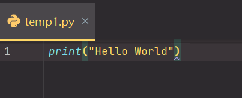
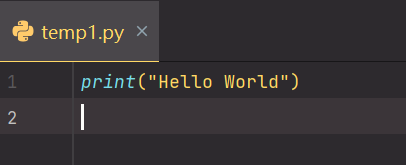
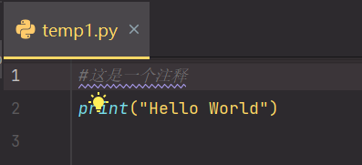
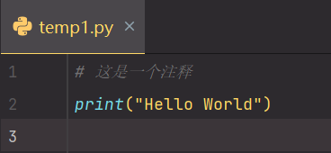
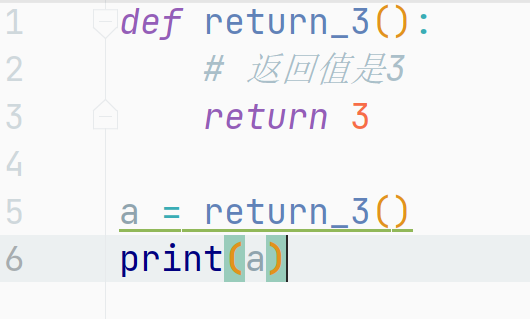
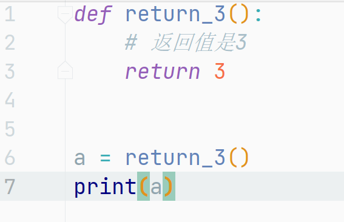

# 一、PEP 8: W292 no newline at end of file

### 1. 报错截图

### 2. 错误原因

Python要求在代码的末尾加上一行空行

### 3. 解决方法

在代码的末尾加入一个换行

# 二、PEP 8: E265 block comment should start with '#'

### 1. 报错截图

### 2. 报错原因

Python要求单行注释在`#`后面加一个空格

### 3. 解决方法

在`#`后面加一个空格

# 三、PEP 8: E305 excepted 2 blank lines, after class or function definition, found 1

### 1. 报错截图

### 2. 报错原因

Python规范要求在函数后面要加两个空行

### 3. 解决方法

在函数后面添加两个空行

