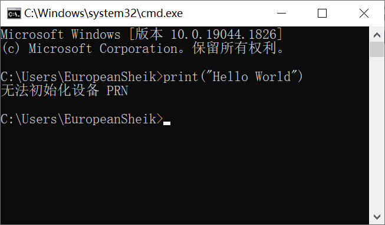
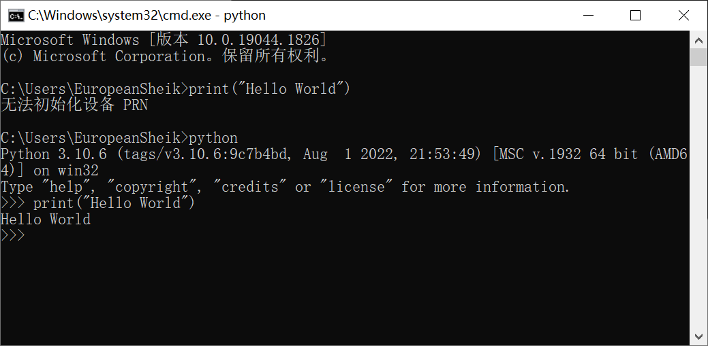
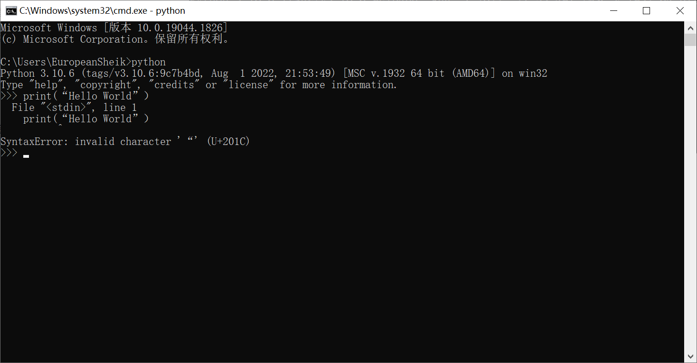
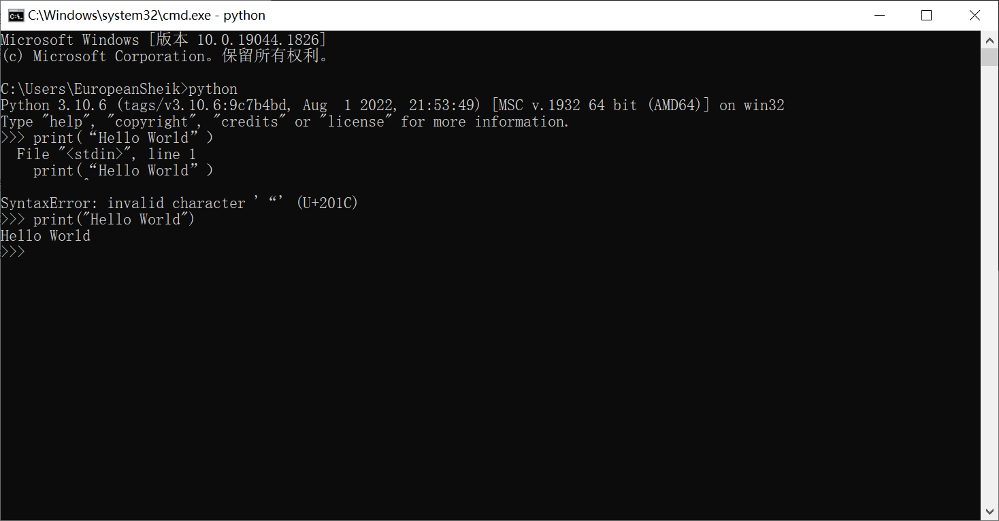
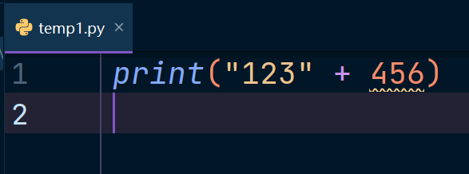
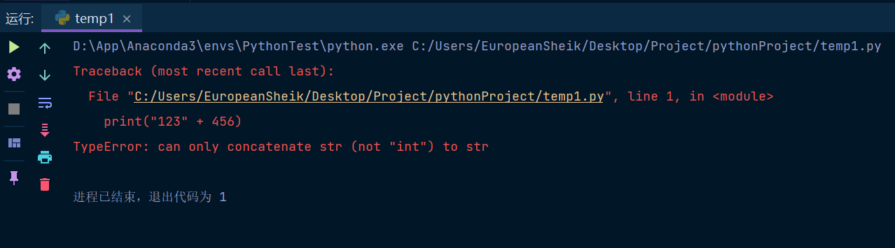
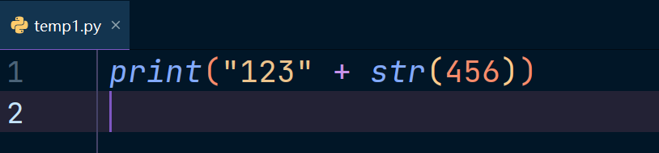
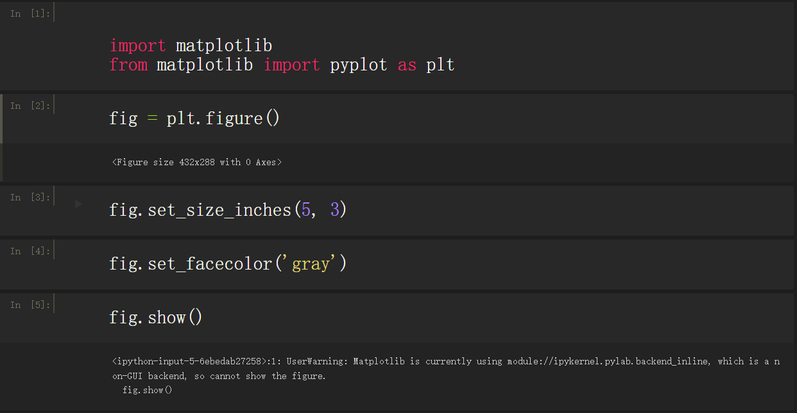

# 一、无法初始化设备 PRN

### 1. 报错截图



### 2. 报错原因

运行Python代码之前没有启动python解释器

### 3. 解决方法

先执行python解释器，再执行python代码



# 二、SyntaxError: invalid character '“' (U+201C)

### 1. 报错截图



### 2. 报错原因

双引号使用错误，应该用英文的双引号，这里面用了中文的双引号

### 3. 解决方法

将中文的双引号替换为英文的双引号



# 三、TypeError: can only concatenate str (not "int") to str

### 1. 报错截图





### 2. 报错原因

字符串不能和数字拼接在一起

### 3. 解决方法

使用str()函数将数字转化为字符串



# 四、ValueError: URL must include a 'scheme', 'host', and 'port' component (ie 'https://localhost:9200')

### 1. 报错截图


### 2. 报错代码

```python
from elasticsearch import Elasticsearch

es = Elasticsearch(hosts="192.168.0.76")
```

### 3. 报错原因

python使用ElasticSearch库连接elasticsearch的时候url不符合格式，是elasticsearch库版本的原因，ElasticSearch==7.14.0以上的版本不支持这样的连接方法

### 4. 解决方案

##### 方案一：修改连接的url

在host中添加`http://`
```python
from elasticsearch import Elasticsearch

es = Elasticsearch(hosts="http://192.168.0.76:9200")
```
##### 方案二：将ElasticSearch库卸载重装低版本

```python
# 卸载原elasticsearch库
pip uninstall elasticsearch
# 安装7.13.0版本的elasticsearch库
pip install elasticsearch==7.13.0
```

# 五、DeprecationWarning: `np.float` is a deprecated alias for the builtin `float`

### 1. 报错截图


### 2. 报错代码


### 3. 报错原因

弃用警告：`np.float`是内置float的不推荐别名。要去除这个Warning，需要单独使用float

人话：`np.float`是将要被弃用的，可以用`float`替代

### 4. 解决方法

使用`float`替代`np.float`


# 六、UserWarning: Matplotlib is currently using module://ipykernel.pylab.backend_inline, which is a non-GUI backend, so cannot show the figure.

1. 报错截图



2. 报错原因

- 报错信息说matplotlib包用的是后端是ipykernel.pylab.backend_inline，这个后端不支持在编译器前端显示。为了支持所有的使用情形，matplotlib能够产生不同的输出，而把每一个不同输出的能力叫做一个后端。而前端就是用户需要处理的代码，如绘图代码，然后后端做的就是所有看不到的辛苦工作来生成视图窗口。这里有两种不同类型的后端：

  - 用户接口后端(又叫做"交互式后端"，如pygtk, wxpython, thinter,qt, macosx或者fltk)。

  - 硬拷贝后端，也叫做非交互式后端，用来生成图像文件(PNG,SVG,PDF, PS)

- 所以matplotlib不显示图象就是当前的用户接口后端不支持前端显示并交互，所以我们需要自己配置。有两种方式配置你的后端。

  - 在matplotlibrc文件中设置后端参数

  - 另外一种方式是使用matplotlib的use()命令。 调用use()方法必须在import matplotlib.pyplot或者matplotlib.pylab之前设置

- 可以使用的后端有 

  ```python
  [‘GTK3Agg’, ‘GTK3Cairo’, ‘MacOSX’, ‘nbAgg’, ‘Qt4Agg’, ‘Qt4Cairo’, ‘Qt5Agg’, ‘Qt5Cairo’, ‘TkAgg’, ‘TkCairo’, ‘WebAgg’, ‘WX’, ‘WXAgg’, ‘WXCairo’, ‘agg’, ‘cairo’, ‘pdf’, ‘pgf’, ‘ps’, ‘svg’, ‘template’]
  ```

### 4. 解决办法

```python
import matplotlib
matplotlib.use('TkAgg')#必须显式指明matplotlib的后端
import matplotlib.pyplot as plt
```


